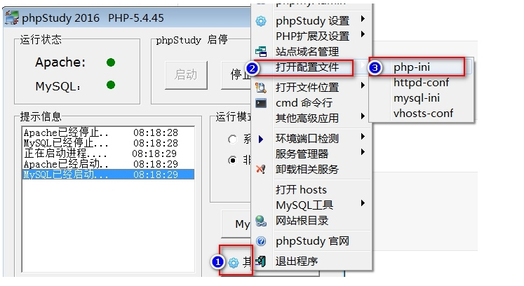

# 03.PHP基础语法
[TOC]
## PHP的基本语法结构(PHP代码写在哪，怎么办？)
1.  我们必须写在.php文件里面
2.  代码风格
标准风格，代码写在`<?php ?>`之间
```php
<?php
	echo 'helloworld';
?>
```
短风格，PHP代码写在`<? ?>`中，要修改PHP配置文件(我的在：D:\phpStudy\php\php-5.4.45\php.ini),让
找到 short_open_tag = Off 改成 short_open_tag = On

```php
<?
	echo 'helloworld';
?>
```
ASP风络,代码写在`<% %>`,要修改PHP配置文件,让PHP支持.
找到 asp_tags = Off 改成 asp_tags = On
```php
<%
    echo 'helloworld';
%>
```
脚本风格写在`<script language="php"></script>`中.
```php
<script language="php">
    echo 'helloworld';
</script>
```
> 注意:PHP与JS有点不同,每个语句后面必须用英文半角的分号(;)结束,而且必须写在PHP代码区域中,(包括PHP注释也必须写在PHP的代码区域中.)

## PHP注释
单行注释://(C++风络)
```php
<?php
    //这是就标准的单行注释......
    echo 'helloworld';
?>
``` 
php也支持用`#`来注释(shell风络)
```php
<?php
    # 这是就标准的单行注释......
    echo 'helloworld';
?>
```
多行注释(区块注释)/**/
```php
/*
    区块注释支持一次注释多行,或行内的某一部分
*/
    echo 'helloworld!';
```
文档注释[了解]:以后进入公司可能会用到,可以用三方工具提取成帮助文档(手册)
```php
/**
以后方便我们生成文档,在某些开发工具下能实现智能提示.
*/
```