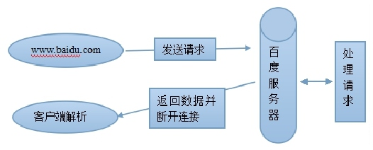
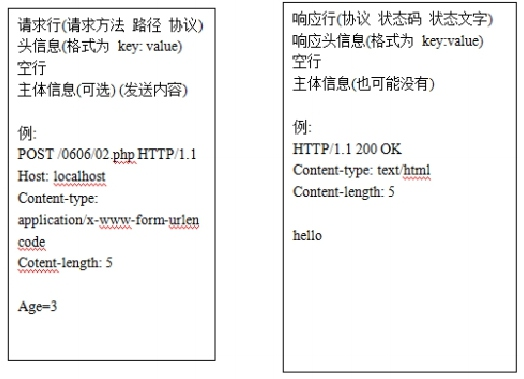
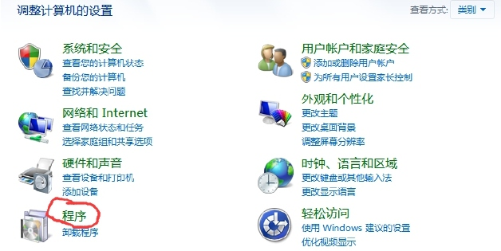
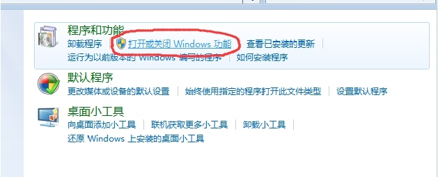
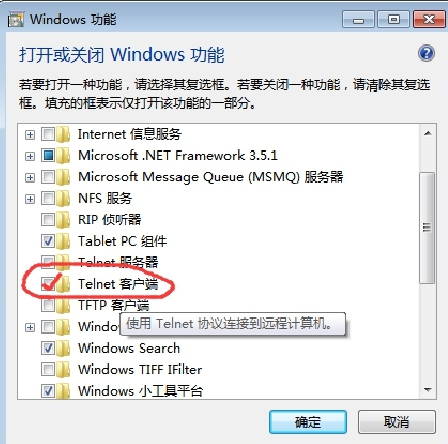
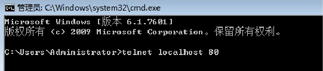
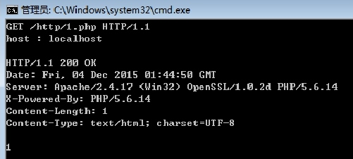
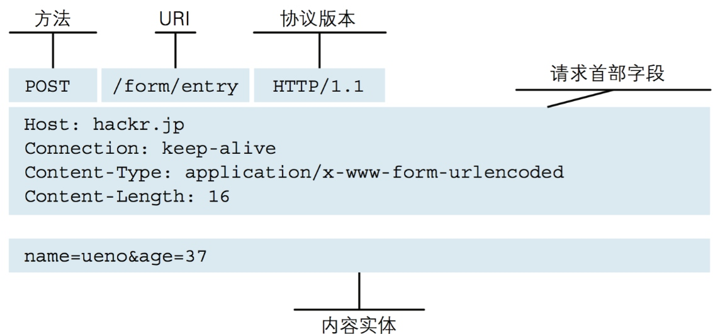
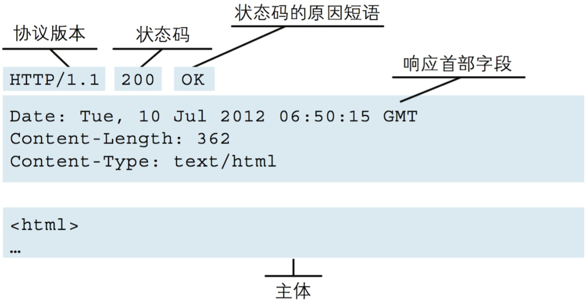

# 033.HTML协议
[TOC]

## 协议
现实生活中的协议，相互遵守，单方面违背，协议不成立；
（停战协议，全球贸易协议）
//没有协议，世界一片混乱
互联网中的协议，ftp、http、stmp、TCP/IP……

## HTTP协议
http(HTTP-Hypertext transfer protocol):超文本传输协议，详细的规定了万维网服务
器与客户端之间数据传送的通信规则；
基本上，你每天都在用；

当你在浏览器输入一个网址并敲下回车键的一刻，发生了什么？
超简版视图 

http属于无状态连接，有状态连接（持续连接）---聊天软件qq，玩网络游戏等

## 请求与响应的格式


## telnet客户端
### windows打开telnet客户端





### 用DOS进行测试HTTP协议
1.(先启运Apache)在DOS窗口中输入telnet localhost 80

2.启用telnet的回显功能   按下  ctrl+]   然后  回车，不然看不到输入的内容。

### 请求与返回
#### 请求
GET /http/1.php HTTP/1.1 (请求方法,资源路径,协议版本)
host：localhost 请求头
//空行（不可控）
主体信息(可为空)

#### 返回


## 请求方法有哪些
```table
方法名 | 备注
GET |	获取一个U RL指定的资源,即资源实体
HEAD |	获取一个指定资源的信息，
POST |	向服务器提交数据
PUT |	向服务器提交资源
DELETE |	请求源服务器删除Request-U RI 标识的资源
TRACE |	网络跟踪
CONNECT |	与PROX Y之间的连接管理
OPTIONS |	查询服务器支持的方法
```
>注：这些方法虽然在HTTP协议里的，但是，服务器并不会对这些方法全部实现
>注意：添加讲解内容--面试中最容易被问到的GET和POST的区别问题，不要陷入误区

### POST请求示例

### 响应示列




## 状态码
常见状态码


