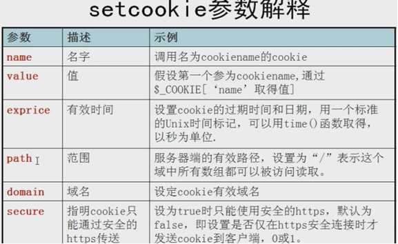

# 034.会话控制之-Cookei
[TOC]

## 会话控制之Cookie概述
cookie:客户端以文件保存个人变量.HTTP协议的一个客户端信息保存机制。


## Cookie的操作



```php
//one.php
<?php
	header("content-type:text/html;charset=utf-8");
	$username = "huodeming";
	setcookie("usrname",$username,time()+60*60*24);
	if(isset($_COOKIE["usrname"])){
		echo "欢迎光临:".$_COOKIE["usrname"];
	}
	echo '<a href="tow.php">第二个页面</a>';
?>
//tow.php
<?php
	header("content-type:text/html;charset=utf-8");
	if(isset($_COOKIE["usrname"])){
		echo "欢迎光临:".$_COOKIE["usrname"];
	}
?>

```

实例2:保存数组形式的数据
```php
	header("content-type:text/html;charset=utf-8");
	setcookie("usr","huodeming",time()+60*60);
	//设置索引数组，必须写下标，不然会发生覆盖
	setcookie("arr[0]","00",time()+60*60);
	setcookie("arr[1]","11",time()+60*60);
	//设置关联数组
	setcookie('brr["usr"]',"hdm",time()+60*60);
	setcookie('brr["pwd"]',"123",time()+60*60);
	setcookie('brr["email"]',"hdm@163.com",time()+60*60);
	//删除:一般值留空，时间为当前时间之前就行
	setcookie('brr["usr"]',"hdm",time()-3600);
	setcookie('brr["pwd"]',"123",time()-3600);
	setcookie('brr["email"]',"hdm@163.com",time()-3600);
	echo "<pre>";
	print_r($_COOKIE);
	echo "</pre>";
```


## Cookie的应用[实例]
课堂实现并讲解，利用cookie实现自动登陆的简单过程及原理。

