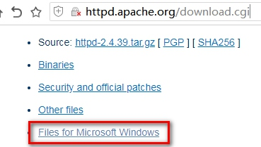
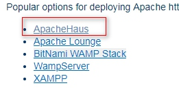
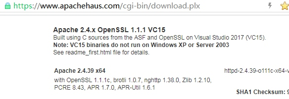
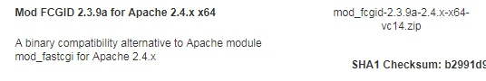
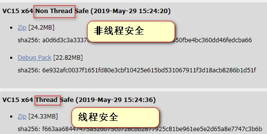
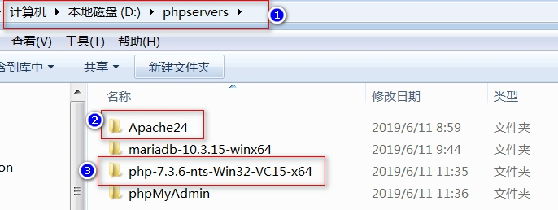
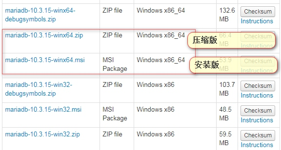

# 039.配置Apache2.4+PHP7.3+多站点
[TOC]

## 下载最新版本Apache  我下载的是2.4.39
### 下载Apache
进入Apache官网,选择windows版本下载
    
各种Windows版本,基本都是三方集成版,以ApacheHaus为例:

来到[https://www.apachehaus.com/cgi-bin/download.plx](https://www.apachehaus.com/cgi-bin/download.plx),可跳过前面两步,直接到此下载,找相应的版本,我是win7_x64系统,安装了VC15运行库,所以我选了64位基于VC15的版本.

在这个页面往下看,顺便把FCGI扩展给下载了,注意版本对应

### 下载PHP[框架要求版本较新,不能低于5.6版本]
下载PHP最新版,目前最新版是7.3.6[https://windows.php.net/download/](https://windows.php.net/download/)
可以选择线程安全与非线程安全版本.我下载了非线程安全的版本


## Apache+PHP的安装与配置
1.把Apache与PHP分别解压到本地,注意路径不要有中文,空格.我解压到D:\phpservers  目录中,全程以此为讲解.


2.解压刚才与Apache一起下载的mod_fcgid-2.3.9a-2.4.x-x64-vc14.zip文件,把里面的Apache24文件夹(复制-粘贴)覆盖到D:\phpservers 中,与Apache24目录合并.

3.配置Apache
编辑D:\phpservers\Apache24\conf\httpd.conf文件,建议用NotePad++等软件,方便些
```shell
# 1.改第38行:为Apache指定根目录
Define SRVROOT "/Apache24" 
# 改为 
Define SRVROOT "D:/phpservers/Apache24"

# 2.去掉第80行注释:让Apache2.4兼容2.2的配置 如Apache2.2版本中的Order、Allow等命令在新版本中也可以得到兼容
LoadModule access_compat_module modules/mod_access_compat.so

# 3.去掉第166行注释:让Apache支持.htaccess文件重写
LoadModule rewrite_module modules/mod_rewrite.so

# 4.在190行处插入一行(我插入在181行处):就是刚才下载并覆盖的FCGI模块
LoadModule fcgid_module modules/mod_fcgid.so

# 5. 找到,也可以把注释的两行去掉注释,但这是apache2.2的语法,我注释掉了.
<Directory />
    AllowOverride none
    Require all denied
</Directory>
# 改成
<Directory />
    Options +Indexes +FollowSymLinks +ExecCGI
    AllowOverride All
#    Order allow,deny
#    Allow from all
    Require all granted
</Directory>

# 6. 找到并修改:默认主页文件顺序
<IfModule dir_module>
    DirectoryIndex index.html
</IfModule>
# 改成
<IfModule dir_module>
    DirectoryIndex index.php index.html l.php
</IfModule>

# 7.查找下面值,并去掉注释:打开虚拟主机配置,支持多站点
Include conf/extra/httpd-vhosts.conf

# 8.增加一行配置,建议放在<IfModule></IfModule>的末尾(失败不报错),当然放在配置文件的末尾也行(失败报错)
Include conf/extra/httpd-fcgid.conf

# 9.让重写模块生效(就是.htaccess),与第4条修改结合用,查找文件中所有的 AllowOverride None 改成
AllowOverride All

# 10.配置文件末尾加一行,这个配置是安装phpmyadmin的,后面用(要结合phpmyadmin.conf用.)
Include conf/phpmyadmin.conf
```
### 配置全局FCGI
修改FCGI配置文件:D:\phpservers\Apache24\conf\extra\httpd-fcgid.conf
```shell
# 1. 修改第9行,第10行,指向PHP所在目录
	FcgidInitialEnv PHPRC "D:\\phpservers\\php-7.3.6-nts-Win32-VC15-x64"
	FcgidInitialEnv PATH "D:\\phpservers\\php-7.3.6-nts-Win32-VC15-x64;C:\\WINDOWS\\system32;C:\\WINDOWS;C:\\WINDOWS\\System32\\Wbem;"
	
# 2.在36行处增加一行,是某些版本不能上传文件(指定可上传文件大小是100MB),但7.3好像不需要,我就注释了,我还是记录下
#	FcgidMaxRequestLen 104857600

# 3.修改第43行,为FCGI指定处理程序
 FcgidWrapper "D:/phpservers/php-7.3.6-nts-Win32-VC15-x64/php-cgi.exe" .php
```
### 配置多站点
要修改两个配置文件
1.修改D:\phpservers\Apache24\conf\httpd.conf
```shell
# 1. [上面apache配置过] 7.查找下面值,并去掉注释:打开虚拟主机配置,支持多站点
Include conf/extra/httpd-vhosts.conf
```
2.修改D:\phpservers\Apache24\conf\extra\httpd-vhosts.conf文件,可以把原内容清掉,重新写入,每个<VirtualHost ></VirtualHost>就是一个站点.
```shell
<VirtualHost _default_:80>
DocumentRoot "D:/phpservers/Apache24/htdocs"
#	Alias /phpmyadmin "D:/phpservers/phpMyAdmin"
    FcgidInitialEnv PHPRC "D:/phpservers/php-7.3.6-nts-Win32-VC15-x64"
    AddHandler fcgid-script .php
    FcgidWrapper "D:/phpservers/php-7.3.6-nts-Win32-VC15-x64/php-cgi.exe" .php
<Directory "D:/phpservers/Apache24/htdocs">
    Options -Indexes +FollowSymLinks +ExecCGI
    AllowOverride All
    Order allow,deny
    Allow from all
    Require all granted
  </Directory>
</VirtualHost>


<VirtualHost *:80>
    #指定站点根目录
    DocumentRoot "D:\phpservers\Apache24\htdocs\tp5.com"
    #指定域名
    ServerName tp5.com
    #域名别名,没有留空,可以多个用空格隔开,多级域名可以用*.xxx.com
    ServerAlias 
    # 设置子目录别名,就是子目录指向别处
#	Alias /phpmyadmin "D:/phpservers/phpMyAdmin"
    # 下面三行是为本站点用FCGI指定PHP版本.
    FcgidInitialEnv PHPRC "D:/phpservers/php-7.3.6-nts-Win32-VC15-x64"
    AddHandler fcgid-script .php
    FcgidWrapper "D:/phpservers/php-7.3.6-nts-Win32-VC15-x64/php-cgi.exe" .php
    #下面是为目录设置访问权限
  <Directory "D:\phpservers\Apache24\htdocs\tp5.com">
      Options FollowSymLinks ExecCGI
      AllowOverride All
      Order allow,deny
      Allow from all
     Require all granted
  </Directory>
</VirtualHost>
```
### 安装phpmyadmin ,多站点配置下并让每个站点可以共享访问
要修改两个配置文件,提供2种方法.
#### 方法1,一次配置永远有效
1.修改apache主配置文件D:\phpservers\Apache24\conf\httpd.conf
```shell
#1. [上面apache配置过] 10.配置文件末尾加一行,这个配置是安装phpmyadmin的,后面用(要结合phpmyadmin.conf用.),注意不要把这行配置写在<IfModule></IfModule>中,否则不生效.
Include conf/phpmyadmin.conf
```
2.用记事本创建一个文件:D:\phpservers\Apache24\conf\phpmyadmin.conf 内容如下:
>这个收集于互联网,注释部分是某些老版本支持,在PHP7.3中会报错.所以注释掉了.
```shell
Alias /phpmyadmin "D:/phpservers/phpMyAdmin"
<Directory "D:/phpservers/phpMyAdmin">
    Options +Indexes +FollowSymLinks +ExecCGI
    AllowOverride All
#    Order allow,deny
#    Allow from all
    Require all granted
#	php_admin_value upload_max_filesize 128M
#	php_admin_value post_max_size 128M
#	php_admin_value max_execution_time 360
#	php_admin_value max_input_time 360
</Directory>
```
#### 方法2:为每个站点单独配置,配置的有效,未配置的无效.
修改多站点配置文件D:\phpservers\Apache24\conf\extra\httpd-vhosts.conf
```shell
# 在每个站点中增加一行,上面示例文件我写进去了,但进行了注释,去掉注释就行了.
#	Alias /phpmyadmin "D:/phpservers/phpMyAdmin"
```

### phpmyadmin下载安装与配置
1. 下载最新版本:https://www.phpmyadmin.net/  目前最新版本是4.9.0.1,直接下载,自带所有语言包.
2. 解压到如下路径:
    D:\phpservers\phpMyAdmin
3. 重命名D:\phpservers\phpMyAdmin\config.sample.inc.php 为 config.inc.php,并修改里面内容:
>phpMyAdmin当然也可以进入配置向导进行配置,但过程繁锁不建议,具体是配好访问路径,用浏览器访问setup目录就行.如:http://localhost/phpmyadmin/setup,按提示操作即可.
```php
$cfg['blowfish_secret'] = '';
//值随便给个字符串就行,如下
$cfg['blowfish_secret'] = 'c4ca4238a0b923820dcc509a6f75899a';
```
### 安装Apache[第一章有介结]
安装Apache:以管理员身份启动DOS,进入到D:\phpservers\Apache24\bin目录,输入:httpd -k install (由于我安装了多次,为了服务名不重复 用了 -n 服务名参数) 等待安装完成.如果报错,重装.提示“The 'Apache2.4' service is successfully installed.”，说明安装成功,失败删除服务重装(sc delete apache24)

## PHP7.3.6的配置
1.修改PHP目录下的配置文件名
D:\phpservers\php-7.3.6-nts-Win32-VC15-x64\php.ini-development 重命名为:php.ini
2.修改里面内容
>配置文件中用到的三个扩展下载,打开下载页找相应版本即可:
1.xdebug用于PHP代码调式: https://xdebug.org/download.php
2.memcache用于session缓存: https://github.com/nono303/PHP7-memcache-dll
3.redis,本地数据库,可取代memcache: https://windows.php.net/downloads/pecl/snaps/redis/4.2.0/
```shell
# 1.指定扩展目录753行:
;extension_dir = "ext"
# 去掉注释并改为如下:路径要对哦.....里面一堆DLL文件.
extension_dir = "D:\phpservers\php-7.3.6-nts-Win32-VC15-x64\ext"

# 2.找到905行,开始改,打开常用扩展.没有的下载
extension=bz2
extension=curl
extension=fileinfo
extension=gd2
extension=mbstring
extension=mysqli
extension=openssl
extension=pdo_mysql
extension=php-7.3.x_memcache.dll #需自己下载:https://github.com/nono303/PHP7-memcache-dll
extension=php_redis #需自己下载https://windows.php.net/downloads/pecl/snaps/redis/4.2.0/
extension=sockets
extension=sqlite3

# 3.设置时区为东8区,就是中国时间:
date.timezone = PRC

# 4.如果打开了sqlite3扩展,就去掉注释
sqlite3.defensive = 1

# 5.设置session文件目录
session.save_path = "D:\phpservers\php-7.3.6-nts-Win32-VC15-x64\tmp"

# 6.配置Xdebug,放在配置文件的最后,xdebug需自己下载:https://xdebug.org/download.php
[XDebug]
xdebug.profiler_output_dir="D:\phpservers\php-7.3.6-nts-Win32-VC15-x64\tmp\xdebug"
xdebug.trace_output_dir="D:\phpservers\php-7.3.6-nts-Win32-VC15-x64\tmp\xdebug"
zend_extension="D:\phpservers\php-7.3.6-nts-Win32-VC15-x64\ext\php_xdebug-2.7.2-7.3-vc15-nts-x86_64.dll"
xdebug.remote_enable = On
```

## 安装MariaDB最新稳定版10.3.15
下载安装超简单https://downloads.mariadb.org 按说明说最新版是10.4,但提示是测试版,不建议用于生产坏境,所以我下载了10.3.15稳定版本.可以下载windows下安装版或压缩版.两个都可以试下.
下面页面:https://downloads.mariadb.org/mariadb/10.3.15/

直接用压缩版.解压到D:\phpservers\mariadb-10.3.15-winx64进行安装
附上my.ini配置文件内容,这是我用安装包得到的,可以放在D:\phpservers\mariadb-10.3.15-winx64根目录下或D:\phpservers\mariadb-10.3.15-winx64\data目录下好像都行.但建议放根目录.
安装: 
```shell
# 第一步:用客理员身份进行命令提示符,进行如下操作:
cd /d D:\phpservers\mariadb-10.3.15-winx64
mysqld --install MariaDB
# 第二步:修改初始密码
#命令示例：
mysql -uroot -p
# (直接回车，默认密码为空)
set password for 'root'@'localhost' = password('root');
# 我的设置过root可以远程访问,所以是
# set password for 'root'@'%' = password('root');
```

```shell
[mysqld]
datadir=D:/phpservers/mariadb-10.3.15-winx64/data
port=3306
innodb_buffer_pool_size=1009M
# default-storage-engine=MyISAM # CSV,MRG_MyISAM,MEMORY,MyISAM,SEQUENCE,InnoDB,Aria,PERFORMANCE_SCHEMA
character-set-server=utf8
[client]
port=3306
plugin-dir=D:/phpservers/mariadb-10.3.15-winx64/lib/plugin
default-character-set=utf8
```


