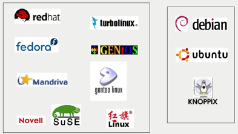
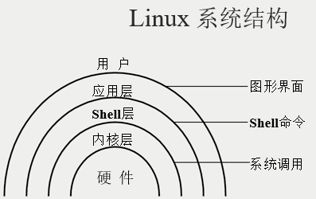

# 01.linux简介
[TOC]

## UNIX/Linux发展历史
1. 1965年，美国麻省理工学院（MIT）、通用电气公司（GE）及AT&T的贝尔实验室联合开发Multics工程计划，其目标是开发一种交互式的具有多道程序处理能力的分时操作系统，但因Multics追求的目标过于庞大复杂，项目进度远远落后于计划，最后贝尔实验室宣布退出。

2. 1969年，美国贝尔实验室的肯 • 汤普森在DEC PDP-7机器上开发出了UNIX系统。
3. 1971年，肯 • 汤普森的同事丹尼斯 • 里奇发明了C语言；1973年，UNIX系统的绝大部分源代码用C语言重写，这为提高UNIX系统的可移植性打下基础。

## UNIX简介及主要发行版本
1971年，肯 • 汤普森的同事丹尼斯 • 里奇发明了C语言；1973年，UNIX系统的绝大部分源代码用C语言重写，这为提高UNIX系统的可移植性打下基础。


主要发行版本
```table
版本 | 公司 | 芯片
AIX | IBM | PowerPC
HP-UX | HP | PA-RISC
Solaris | Sun | SPARC
Irix | SGI | MIPS
DigitalUNIX | DEC | Alpha
Linux、BSD | RedHat Linux、Ubuntu、FreeBSD | IA（Intel、AMD、Cyrix、RISE...）
```
## Linux简介及主要发行版本
Linux系统出现于1991年，由芬兰大学生李纳斯（Linus Torvalds）和后来陆续加入的众多爱好者共同开发完成。Linux是一个自由软件，是源代码开放的UNIX。

主要发行版本: 两个分支 内核一样，主要是软件安装方式不同

## Linux的特点
### 自由软件
1. 使用自由: 可以不受任何限制地使用软件
2. 研究自由: 可以获得软件源代码，研究软件运行方式
3. 散布自由: 可以自由复制软件及散布给他人
4. 改良自由: 要吧自行改良软件并散布改良后的版本

### 优良特性
1. 分时的多用户、多任务的操作系统
2. 多数网络协议支持，方便的远程管理
3. 强大的内存管理和文件管理系统
4. 大量的可用软件和免费软件
5. 优良的稳定性和安全性
6. 良好的可移植性和灵活性
7. 可供选择的厂商多

### 系统结构


### X Window简介

### Linux 应用领域
1. 电子政务
 - 办公应用-OpenOffice
 - 在Linux下，也有各种游戏
2. 网络应用
 - 基于LAMP的网站论坛及B/S架构应用
 - 基于Linux的负载均衡和集群
 - 基于Linux的防火墙及代理服务器
 - 基于Linux的网游服务器
 - 介绍一个采点网站，来测试与查看各站点服务器数据:http://www.netcraft.com
     + 踩点:https://sitereport.netcraft.com/
     +  查看WEB服务器详情:https://news.netcraft.com/

3. 科学运算
4. 嵌入式应用
## Linux学习方法

### 学习环境建议
1. 选择一个适合入门的Linux版本(从众多Linux版本中选择CentOS)
2. 建议使用虚拟机软件
3. 忘记Windows的思维方式

### 选择命令行学习
1. 英文提示的困惑: 
 - 1.多记常用单词(命令)
 - 2.多操作，熟能生巧
2. 遇到问题的智慧
 - 留意系统的提示信息
 - 尝试自己检查或试验以找到答案(帮助，文档，示例，查找)