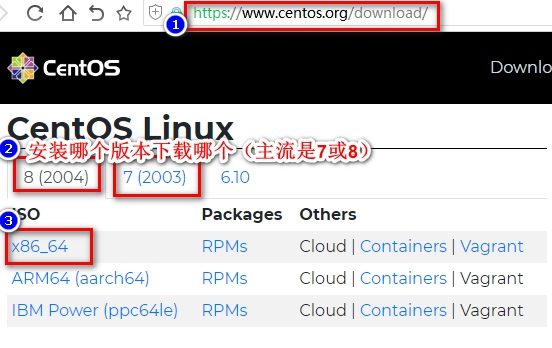
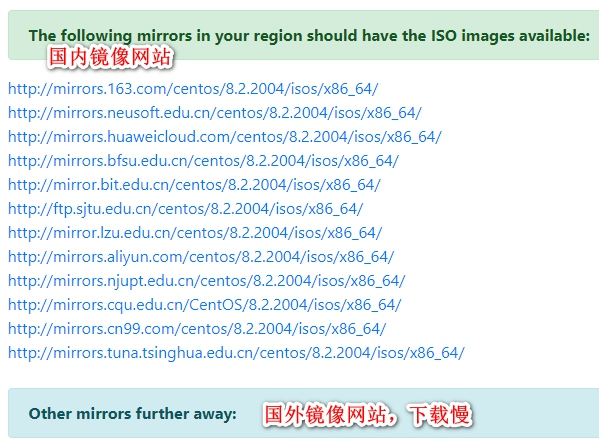
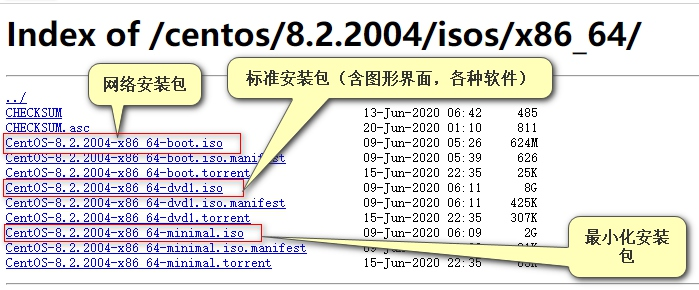
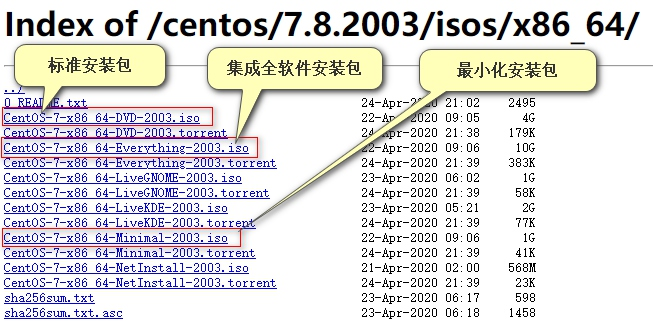

# 02.下载安装Linux
[TOC]

## 下载CentOS
[官方网站: https://www.centos.org/download/](https://www.centos.org/download/)
第一步:选择要下载的版本，目前可下载是6,7,8三个三版。我们都是下载X86_64平台的就行。

第二步:选择下载镜像，以8版本为例(只要是国内的都比较快)

第三步:选择要下载的文件，以8版本为例

第三步: 以7版本为例，Live的版本为光盘直接运行版。

6版本就不作介绍，因官方给出提示是:End-of-life:30 Nov 2020   就是说2020年11月30号以后官方就不再维护了(如果后面有更新再说)，以后在线安装软件都有可能有问题，所以就不作介绍了。如果要安装，介绍下需下载的文件:发现有两个光盘镜像:CentOS-6.10-x86_64-bin-DVD1.iso  CentOS-6.10-x86_64-bin-DVD2.iso，注意读README.txt文件，中提到:(这两个dvd映像包含整个基本发行版。请将DVD1刻录到DVD上，然后启动计算机。基本安装不需要DVD2。安装完成后，请运行“yum update”以更新您的系统。)
所以如果安装6.10，下载CentOS-6.10-x86_64-bin-DVD1.iso即可。

## 安装:
虚拟机安装与实际电脑安装差不多，主要是引导时要注意下，后面步聚差不多。
### 虚拟机下载安装
1. 下载虚拟机，建议下载VMware Workstation,分享下载地址:[点击下载](https://download3.vmware.com/software/wkst/file/VMware-workstation-full-15.5.6-16341506.exe)，附赠激活密钥:YG5H2-ANZ0H-M8ERY-TXZZZ-YKRV8 UG5J2-0ME12-M89WY-NPWXX-WQH88 UA5DR-2ZD4H-089FY-6YQ5T-YPRX6
2. 演示安装虚拟机
3. 创建虚拟机
### CentOS8建议分区方案
普通分区方案，三个必须的挂载点
```shell
/boot 引导分区 256M
swap 交换分区 内存1.5倍，内存大于等于8G内存，swap给8G。
/ 根分区，给所有空间
```
门户网站分区方案
```shell
/boot  256M
swap 内存<8G, 分1.5倍，内存>=8G,swap给8G
/  给100G
#剩余空间保留，将来哪个部门使用，给使用部分再分剩余的空间。
```
存储服务器方案
```shell
/boot  256M
swap 内存<8G, 分1.5倍，内存>=8G,swap给8G
/  给100G
/data  剩余给数据分区，data可以任意名称
```

###在虚拟机中安装CentOS[实操]


### 实际电脑中安装CentOS[实操]


