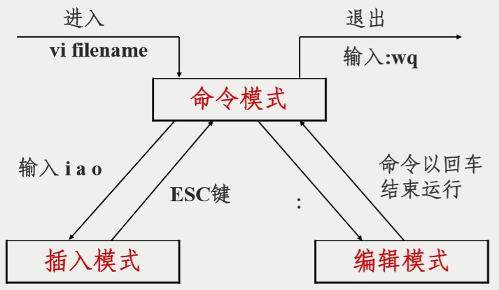

# 06.文本编辑器vim
[TOC]
早期版本叫vi，新版本叫vim, 他们是同一个软件。
Vim/Vi是一个功能强大的全屏幕文本编辑器，是Linux/UNIX上最常用的文本编辑器，它的作用是建立、编辑、显示文本文件。
Vim/Vi 没有菜单，只有命令。

## vi工作模式

## 插入命令aio
```table
命令 | 作用
a | 在光标后附加文本
A | 在本行行末附加文本
i | 在光标前插入文本
I | 在本行开始插入文本
o | 在光标下插入新行
O | 在光标上插入新行
```
## 定位命令
```table
命令 | 作用
: set nu | 设置行号
: set nonu | 取消行号
gg | 到第一行
 G | 到最后一行
nG | 到第n行
:n | 到第n行
$ | 移至行尾
0 | 移至行首
h | 方向左键	左移一个字符
j | 方向下键	下移一行
k | 方向上键	下移一行
l | 方向右键	右移一个字符
H | 移至屏幕上端
M | 移至屏幕中央
L | 移至屏幕下端
```
## 删除命令
```table
命令	作用
x | 删除光标所在处字符
nx | 删除光标所在处后n个字符
dd | 删除光标所在行，ndd删除n行
dG | 删除光标所在行到末尾的内容
D | 删除从光标所在处到行尾
:n1,n2d | 删除指定范围的行
```
## 复制和剪切命令
```table
命令 | 作用
yy、Y | 复制当前行
nyy、nY | 复制当前行以下n行
dd | 剪切当前行
ndd | 剪切当前行以下n行
p、P | 粘贴在当前光标所在行下或行上
```
## 替换和取消命令
```table
命令 | 作用
r | 取代光标所在处字符
R | 从光标所在处开始替换字符，按Esc结束
u | 取消上一步操作
```
## 搜索和替换命令
```table
命令 | 作用
/string | 向前搜索指定字符串,搜索时忽略大小写 :set ic
n | 搜索指定字符串的下一个出现位置
:%s/old/new/g | 全文替换指定字符串
:n1,n2s/old/new/g | 在一定范围内替换指定字符串
```
## 保存和退出命令
```table
命令 | 作用
:w	 | 保存修改
:w | new_filename	另存为指定文件
:wq | 保存修改并退出
ZZ | 快捷键，保存修改并退出
:q! | 不保存修改退出
:wq! | 保存修改并退出（文件所有者可忽略文件的只读属性）,注意只有root与文件所有者才能用。
```
## 使用技巧
```shell
:r 文件名      #导入一个文件的内容到当前文件光标位置
:!系统指令  #在不退出vim的情况下执行相关操作命令
:r !系统指令   # 把一个系统命令执行的结果保存到当前文档的光标位置(结合上面两个命令)

#自定义快捷键
:map ^P I#<ESC>  
#过程是  在命令模式下  输入:
#:map 空格 CTRL+V,CTRL+P 空格 I#<ESC>    
#意思就是:创建一个快捷键  CTRL+P  把本行注释掉(I定位到行首，输入#键，退出编辑模式)。
 
#连续注释行
:n1,n2s/^/#/g  #  如  1,4s/^/#/g   把第一行到第四行，在行首插入# ，/g是不需要确认
#去掉连续行注释
:n1,n2s/^#//g  #  如  1,4s/^#//g   把第一行到第四行的首行#替换为空
#用//去注释
:n1,n2s/^/\/\//g  #  如  1,4s/^/\/\//g    把第一行到第四行，在行首插入// ，像PHP的注释。

#ab命令 可以理解成  在 vi中输出  a   它自动变成 b
:ab  myemail huodeming1@163.com #当你在插入模式输入myemail时，它自动变成邮箱地址

#配置文件，所有设置临时生效，想永久生效则编辑  用户家目录/.vimrc 文件，只能是编辑模式命令才生效
vi ~/.vimrc
#内容
set nu
map ^p I#<ESC>
:ab  myemail huodeming1@163.com
```