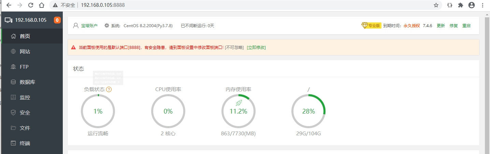

# 03.配置局域网yum服务器-方便局域网安装软件
[TOC]

## 1.安装http服务器，建议安装宝塔面板-个人学习建议用破解版
参见: https://k.youko.me/install.php


### 安装专业宝塔
Centos安装脚本  面板端口：8888
```shell
yum install -y wget && wget -O install.sh https://download.youko.me/install/install_6.0.sh && sh install.sh
```
试验性Centos/Ubuntu/Debian安装命令 独立运行环境（py3.7） 可能存在少量兼容性问题 不断优化中
```shell
curl -sSO https://download.youko.me/install/install_panel.sh && bash install_panel.sh
```
Ubuntu/Deepin安装脚本
```shell
wget -O install.sh https://download.youko.me/install/install-ubuntu_6.0.sh && sudo bash install.sh
```
Debian安装脚本
```shell
wget -O install.sh https://download.youko.me/install/install-ubuntu_6.0.sh && bash install.sh
```
Fedora安装脚本
```shell
wget -O install.sh https://download.youko.me/install/install_6.0.sh && bash install.sh
```
Linux面板7.4.5升级命令（已安装面板或旧版本或免费版升级专业版）
```shell
curl https://download.youko.me/install/update6.sh|bash
```
Nginx/Apache官方防火墙安装命令
```shell
Nginx直接面板安装防火墙使用 / Apache先面板安装防火墙在使用bt命令20修复！
```

### 安装企业宝塔
Centos安装脚本  面板端口：8888
```shell
yum install -y wget && wget -O install.sh https://download.youko.me/ltd/install/install_6.0.sh && sh install.sh
```
试验性Centos/Ubuntu/Debian安装命令 独立运行环境（py3.7） 可能存在少量兼容性问题 不断优化中
```shell
curl -sSO https://download.youko.me/ltd/install/install_panel.sh && bash install_panel.sh
```
Ubuntu/Deepin安装脚本
```shell
wget -O install.sh https://download.youko.me/ltd/install/install-ubuntu_6.0.sh && sudo bash install.sh
```
Debian安装脚本
```shell
wget -O install.sh https://download.youko.me/ltd/install/install-ubuntu_6.0.sh && bash install.sh
```
Fedora安装脚本
```shell
wget -O install.sh https://download.youko.me/ltd/install/install_6.0.sh && bash install.sh
```
Linux面板7.4.5升级命令（已安装面板或旧版本或免费版升级企业版）
```shell
curl https://download.youko.me/ltd/install/update6.sh|bash
```
Nginx/Apache官方防火墙安装命令
```shell
Nginx直接面板安装防火墙使用 / Apache先面板安装防火墙在使用bt命令20修复！
```

### 第三方插件列表
百度云网盘
```shell
等待发布~
```
服务器日志分析与流量统计
```shell
等待发布~
```

### 安装5系旧版宝塔
Centos安装脚本
```shell
yum install -y wget && wget -O install.sh https://download.youko.me/install/install.sh && sh install.sh
```
Ubuntu/Deepin安装脚本
```shell
wget -O install.sh https://download.youko.me/install/install-ubuntu.sh && sudo bash install.sh
```
Debian安装脚本
```shell
wget -O install.sh https://download.youko.me/install/install-ubuntu.sh && bash install.sh
```
Fedora安装脚本
```shell
wget -O install.sh https://download.youko.me/install/install.sh && bash install.sh
```
Linux面板5.9.2升级命令（免费版升级专业版）
```shell
wget -O update.sh https://download.youko.me/install/update.sh && sh update.sh pro
```

### 管理宝塔
宝塔工具箱(包含下列绝大部分功能 直接ssh中执行bt命令 仅限6.x以上版本面板)
```shell
bt
```
停止
```shell
/etc/init.d/bt stop
```
启动
```shell
/etc/init.d/bt start
```
重启
```shell
/etc/init.d/bt restart
```
卸载
```shell
/etc/init.d/bt stop && chkconfig --del bt && rm -f /etc/init.d/bt && rm -rf /www/server/panel
```
查看当前面板端口
```shell
cat /www/server/panel/data/port.pl
```
修改面板端口，如要改成8881（centos 6 系统）
```shell
echo '8881' > /www/server/panel/data/port.pl && /etc/init.d/bt restart
iptables -I INPUT -p tcp -m state --state NEW -m tcp --dport 8881 -j ACCEPT
service iptables save
service iptables restart
```
修改面板端口，如要改成8881（centos 7 系统）
```shell
echo '8881' > /www/server/panel/data/port.pl && /etc/init.d/bt restart
firewall-cmd --permanent --zone=public --add-port=8881/tcp
firewall-cmd --reload
```
强制修改MySQL管理(root)密码，如要改成123456
```shell
cd /www/server/panel && python tools.py root 123456
```
修改面板密码，如要改成123456
```shell
cd /www/server/panel && python tools.py panel 123456
```
查看宝塔日志
```shell
cat /tmp/panelBoot.pl
```
删除域名绑定面板
```shell
rm -f /www/server/panel/data/domain.conf
```
清理登陆限制
```shell
rm -f /www/server/panel/data/*.login
```
查看面板授权IP
```shell
cat /www/server/panel/data/limitip.conf
```
关闭访问限制
```shell
rm -f /www/server/panel/data/limitip.conf
```
查看许可域名
```shell
cat /www/server/panel/data/domain.conf
```
关闭面板SSL
```shell
rm -f /www/server/panel/data/ssl.pl && /etc/init.d/bt restart
```
查看面板错误日志
```shell
cat /tmp/panelBoot
```
查看数据库错误日志
```shell
cat /www/server/data/*.err
```