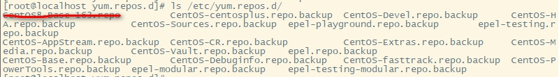

# 塔建局域网yum服务器-局域网学习用
[TOC]

## 第一步:安装WEB服务器。
建议安装宝塔或小皮面板，我以宝塔为例

## 第二步: 创建一个网站，并配置下可显示目录结构
我的配置  ->在宝塔(用的是Nginx1.18.0)中添加站点:

创建好站点后，我在站点目录下创建了一个yum_data的目录，并配置一下站点伪静态(用的是Nginx1.18.0)，目的就是让站点可以显示yum_data的目录结构。

```shell
location /yum_data {   
	autoindex on;  #开启nginx目录浏览功能
	autoindex_exact_size off;  #文件大小从KB开始显示,默认是byte
	autoindex_localtime on;  #显示文件修改时间为服务器本地时间，默认是GMT时间 
}
```
配置好后用浏览器访问:http://192.168.0.105/yum_data/，显示如下则成功


## 创建同步yum的目录
所有包都放在/www/wwwroot/192.168.0.105/yum_data/目录下,目录参照国内一些镜像服务器下的.repo文件,像https://mirrors.aliyun.com/repo/Centos-8.repo文件内容,只要3个目录一般就行:[AppStream],[base],[extras],[PowerTools]这个我是看Centos8默认启用的,所以我也加上.
创建相关目录,我们只同步x86_64的
```shell
/usr/bin/mkdir -p /www/wwwroot/192.168.0.102/yum_data/centos/8.2.2004/AppStream/x86_64/
/usr/bin/mkdir -p /www/wwwroot/192.168.0.102/yum_data/centos/8.2.2004/BaseOS/x86_64/
/usr/bin/mkdir -p /www/wwwroot/192.168.0.102/yum_data/centos/8.2.2004/PowerTools/x86_64/
/usr/bin/mkdir -p /www/wwwroot/192.168.0.102/yum_data/centos/8.2.2004/extras/x86_64/
/usr/bin/mkdir -p /www/wwwroot/192.168.0.102/yum_data/epel/8/Everything/x86_64/
/usr/bin/mkdir -p /www/wwwroot/192.168.0.102/yum_data/epel/8/Modular/x86_64/
#/usr/bin/mkdir -p /www/wwwroot/192.168.0.102/yum_data/zabbix/
```
## 安装rsync并同步yum源
```shell
yum install rsync
/usr/bin/rsync -avz --progress --no-motd  rsync://mirrors.163.com/centos/8.2.2004/AppStream/x86_64/ /www/wwwroot/192.168.0.102/yum_data/centos/8.2.2004/AppStream/x86_64/
/usr/bin/rsync -avz --progress --no-motd  rsync://mirrors.163.com/centos/8.2.2004/BaseOS/x86_64/ /www/wwwroot/192.168.0.102/yum_data/centos/8.2.2004/BaseOS/x86_64/
/usr/bin/rsync -avz --progress --no-motd  rsync://mirrors.163.com/centos/8.2.2004/PowerTools/x86_64/ /www/wwwroot/192.168.0.102/yum_data/centos/8.2.2004/PowerTools/x86_64/
/usr/bin/rsync -avz --progress --no-motd  rsync://mirrors.163.com/centos/8.2.2004/extras/x86_64/ /www/wwwroot/192.168.0.102/yum_data/centos/8.2.2004/extras/x86_64/
/usr/bin/rsync -avz --progress --exclude=debug --no-motd rsync:/mirror.tuna.tsinghua.edu.cn/epel/8/Everything/x86_64/ /www/wwwroot/192.168.0.102/yum_data/epel/8/Everything/x86_64/
/usr/bin/rsync -avz --progress --exclude=debug --no-motd rsync://mirror.tuna.tsinghua.edu.cn/epel/8/Modular/x86_64/ /www/wwwroot/192.168.0.102/yum_data/epel/8/Modular/x86_64/
#/usr/bin/rsync -avz --progress --exclude=rhel/7/SRPMS --no-motd rsync://mirror.tuna.tsinghua.edu.cn/zabbix/ /www/wwwroot/192.168.0.102/yum_data/zabbix/
```

## 安装createrepo
createrepo主要进行此程序主要用于生成创建yum仓库，创建索引信息。
```shell
yum install createrepo -y
createrepo /www/wwwroot/192.168.0.102/yum_data/centos/8.2.2004/AppStream/x86_64/
createrepo /www/wwwroot/192.168.0.102/yum_data/centos/8.2.2004/BaseOS/x86_64/
createrepo /www/wwwroot/192.168.0.102/yum_data/centos/8.2.2004/PowerTools/x86_64/
createrepo /www/wwwroot/192.168.0.102/yum_data/centos/8.2.2004/extras/x86_64/
createrepo /www/wwwroot/192.168.0.102/yum_data/epel/8/Everything/x86_64/
createrepo /www/wwwroot/192.168.0.102/yum_data/epel/8/Modular/x86_64/
#createrepo /www/wwwroot/192.168.0.102/yum_data/zabbix/
```
## 下载签名文件到yum_data目录中,后面签名要用到
也可以不下载签名文件,在/www/wwwroot/192.168.0.105/yum_data/help/CentOS8-Base-163.repo文年中注意使用gpgcheck=0   不要用 gpgkey=http://192.168.0.105/yum_data/RPM-GPG-KEY-CentOS-7
```shell
wget -O /www/wwwroot/192.168.0.105/yum_data/centos/RPM-GPG-KEY-CentOS-7 http://mirrors.163.com/centos/RPM-GPG-KEY-CentOS-7
```

## 以163.com为例,创建.repo文件,放help目录中,以方便客户机下载使用.
```shell
mkdir /www/wwwroot/192.168.0.105/yum_data/help/
# 下面三个是以下载163.com的三个版本repo文件为例:
#wget -O  /www/wwwroot/192.168.0.102/yum_data/help/CentOS8-Base-163.repo http://mirrors.163.com/.help/CentOS8-Base-163.repo
#wget -O  /www/wwwroot/192.168.0.102/yum_data/help/CentOS8-Base-163.repo http://mirrors.163.com/.help/CentOS7-Base-163.repo
#wget -O  /www/wwwroot/192.168.0.102/yum_data/help/CentOS8-Base-163.repo http://mirrors.163.com/.help/CentOS6-Base-163.repo

vi /www/wwwroot/192.168.0.105/yum_data/help/CentOS8-Base.repo
# 文件内容如下:因为没有下载[epel]与[epel-modular]的包,所以参照系统原样做了两个节点===========
# CentOS-Base.repo
# 
# The mirror system uses the connecting IP address of the client and the
# update status of each mirror to pick mirrors that are updated to and
# geographically close to the client.  You should use this for CentOS updates
# unless you are manually picking other mirrors.
#
# If the mirrorlist= does not work for you, as a fall back you can try the 
# remarked out baseurl= line instead.
#
#
[AppStream]
name=CentOS-$releasever - AppStream
baseurl=http://192.168.0.105/yum_data/centos/8.2.2004/AppStream/$basearch/os
enabled=1
gpgcheck=1
gpgkey=http://192.168.0.105/yum_data/RPM-GPG-KEY-CentOS-7

[base]
name=CentOS-$releasever - Base
baseurl=http://192.168.0.105/yum_data/centos/8.2.2004/BaseOS/$basearch/os
enabled=1
gpgcheck=1
gpgkey=http://192.168.0.105/yum_data/RPM-GPG-KEY-CentOS-7

[extras]
name=CentOS-$releasever - Extras - 163.com
baseurl=http://192.168.0.105/yum_data/centos/8.2.2004/extras/$basearch/os
enabled=1
gpgcheck=1
gpgkey=http://192.168.0.105/yum_data/RPM-GPG-KEY-CentOS-7

[PowerTools]
name=CentOS-$releasever - PowerTools - 163.com
baseurl=http://192.168.0.105/yum_data/centos/8.2.2004/PowerTools/$basearch/os
gpgcheck=1
enabled=1
gpgkey=http://192.168.0.105/yum_data/RPM-GPG-KEY-CentOS-7

[epel]
name=Extra Packages for Enterprise Linux $releasever - $basearch
#baseurl=https://download.fedoraproject.org/pub/epel/$releasever/Everything/$basearch
metalink=https://mirrors.fedoraproject.org/metalink?repo=epel-$releasever&arch=$basearch&infra=$infra&content=$contentdir
enabled=1
gpgcheck=1
gpgkey=file:///etc/pki/rpm-gpg/RPM-GPG-KEY-EPEL-8

[epel-modular]
name=Extra Packages for Enterprise Linux Modular $releasever - $basearch
#baseurl=https://download.fedoraproject.org/pub/epel/$releasever/Modular/$basearch
metalink=https://mirrors.fedoraproject.org/metalink?repo=epel-modular-$releasever&arch=$basearch&infra=$infra&content=$contentdir
enabled=1
gpgcheck=1
gpgkey=file:///etc/pki/rpm-gpg/RPM-GPG-KEY-EPEL-8
```

## 客户机更新yum源
客户机上修改yum配置文件/etc/yum.repos.d/目录下的`.repo`，为主要的配置文件重命名为 `.repo.backup`，

下载刚才创建的CentOS8-Base-163.repo文件到此目录中.
```shell
wget -O /etc/yum.repos.d/CentOS8-Base.repo http://192.168.0.105/yum_data/help/CentOS8-Base.repo
```
更新本地yum源缓存
```shell
yum clean all
yum makecache
```
查看yum列表
```shell
yum list
```

## 服务器上简单脚本:centos8实列
```shell
#!/bin/bash
echo "========mkdir dir ing...============="
/usr/bin/mkdir -p /www/wwwroot/192.168.0.102/yum_data/centos/8.2.2004/AppStream/x86_64/
/usr/bin/mkdir -p /www/wwwroot/192.168.0.102/yum_data/centos/8.2.2004/BaseOS/x86_64/
/usr/bin/mkdir -p /www/wwwroot/192.168.0.102/yum_data/centos/8.2.2004/PowerTools/x86_64/
/usr/bin/mkdir -p /www/wwwroot/192.168.0.102/yum_data/centos/8.2.2004/extras/x86_64/
/usr/bin/mkdir -p /www/wwwroot/192.168.0.102/yum_data/epel/8/Everything/x86_64/
/usr/bin/mkdir -p /www/wwwroot/192.168.0.102/yum_data/epel/8/Modular/x86_64/
#/usr/bin/mkdir -p /www/wwwroot/192.168.0.102/yum_data/zabbix/

echo "========install rsync...============="
yum install rsync

echo "========rsync ing...============="
/usr/bin/rsync -avz --progress --no-motd  rsync://mirrors.163.com/centos/8.2.2004/AppStream/x86_64/ /www/wwwroot/192.168.0.102/yum_data/centos/8.2.2004/AppStream/x86_64/
/usr/bin/rsync -avz --progress --no-motd  rsync://mirrors.163.com/centos/8.2.2004/BaseOS/x86_64/ /www/wwwroot/192.168.0.102/yum_data/centos/8.2.2004/BaseOS/x86_64/
/usr/bin/rsync -avz --progress --no-motd  rsync://mirrors.163.com/centos/8.2.2004/PowerTools/x86_64/ /www/wwwroot/192.168.0.102/yum_data/centos/8.2.2004/PowerTools/x86_64/
/usr/bin/rsync -avz --progress --no-motd  rsync://mirrors.163.com/centos/8.2.2004/extras/x86_64/ /www/wwwroot/192.168.0.102/yum_data/centos/8.2.2004/extras/x86_64/
/usr/bin/rsync -avz --progress --exclude=debug --no-motd rsync:/mirror.tuna.tsinghua.edu.cn/epel/8/Everything/x86_64/ /www/wwwroot/192.168.0.102/yum_data/epel/8/Everything/x86_64/
/usr/bin/rsync -avz --progress --exclude=debug --no-motd rsync://mirror.tuna.tsinghua.edu.cn/epel/8/Modular/x86_64/ /www/wwwroot/192.168.0.102/yum_data/epel/8/Modular/x86_64/
#/usr/bin/rsync -avz --progress --exclude=rhel/7/SRPMS --no-motd rsync://mirror.tuna.tsinghua.edu.cn/zabbix/ /www/wwwroot/192.168.0.102/yum_data/zabbix/

echo "========install createrepo...============="
yum install createrepo -y

echo "========createrepo ing...============="
createrepo /www/wwwroot/192.168.0.102/yum_data/centos/8.2.2004/AppStream/x86_64/
createrepo /www/wwwroot/192.168.0.102/yum_data/centos/8.2.2004/BaseOS/x86_64/
createrepo /www/wwwroot/192.168.0.102/yum_data/centos/8.2.2004/PowerTools/x86_64/
createrepo /www/wwwroot/192.168.0.102/yum_data/centos/8.2.2004/extras/x86_64/
createrepo /www/wwwroot/192.168.0.102/yum_data/epel/8/Everything/x86_64/
createrepo /www/wwwroot/192.168.0.102/yum_data/epel/8/Modular/x86_64/
#createrepo /www/wwwroot/192.168.0.102/yum_data/zabbix/

echo "========wget RPM-GPG-KEY-CentOS-7  ing...============="
wget -O /www/wwwroot/192.168.0.105/yum_data/centos/RPM-GPG-KEY-CentOS-7 http://mirrors.163.com/centos/RPM-GPG-KEY-CentOS-7

echo "========wget CentOS*-Base-163.repo  ing...============="
mkdir /www/wwwroot/192.168.0.102/yum_data/help/
wget -O  /www/wwwroot/192.168.0.102/yum_data/help/CentOS8-Base-163.repo http://mirrors.163.com/.help/CentOS8-Base-163.repo
wget -O  /www/wwwroot/192.168.0.102/yum_data/help/CentOS8-Base-163.repo http://mirrors.163.com/.help/CentOS7-Base-163.repo
wget -O  /www/wwwroot/192.168.0.102/yum_data/help/CentOS8-Base-163.repo http://mirrors.163.com/.help/CentOS6-Base-163.repo

touch /www/wwwroot/192.168.0.102/yum_data/help/CentOS8-Base.repo
cat > /www/wwwroot/192.168.0.102/yum_data/help/CentOS8-Base.repo << EOF
# CentOS-Base.repo
#
# The mirror system uses the connecting IP address of the client and the
# update status of each mirror to pick mirrors that are updated to and
# geographically close to the client.  You should use this for CentOS updates
# unless you are manually picking other mirrors.
#
# If the mirrorlist= does not work for you, as a fall back you can try the 
# remarked out baseurl= line instead.
#
#
[AppStream]
name=CentOS-\$releasever - AppStream - huodeming
baseurl=http://192.168.0.105/yum_data/centos/8.2.2004/AppStream/\$basearch/os
enabled=1
gpgcheck=1
gpgkey=http://192.168.0.105/yum_data/RPM-GPG-KEY-CentOS-7

[base]
name=CentOS-\$releasever - Base - huodeming
baseurl=http://192.168.0.105/yum_data/centos/8.2.2004/BaseOS/\$basearch/os
enabled=1
gpgcheck=1
gpgkey=http://192.168.0.105/yum_data/RPM-GPG-KEY-CentOS-7

[extras]
name=CentOS-\$releasever - Extras - huodeming
baseurl=http://192.168.0.105/yum_data/centos/8.2.2004/extras/\$basearch/os
enabled=1
gpgcheck=1
gpgkey=http://192.168.0.105/yum_data/RPM-GPG-KEY-CentOS-7

[PowerTools]
name=CentOS-\$releasever - PowerTools - huodeming
baseurl=http://192.168.0.105/yum_data/centos/8.2.2004/PowerTools/\$basearch/os
gpgcheck=1
enabled=1
gpgkey=http://192.168.0.105/yum_data/RPM-GPG-KEY-CentOS-7

[epel]
name=Extra Packages for Enterprise Linux \$releasever - \$basearch - huodeming
baseurl=http://192.168.0.105/yum_data/epel/\$releasever/Everything/\$basearch
#metalink=https://mirrors.fedoraproject.org/metalink?repo=epel-\$releasever&arch=\$basearch&infra=\$infra&content=\$contentdir
enabled=1
gpgcheck=1
gpgkey=file:///etc/pki/rpm-gpg/RPM-GPG-KEY-EPEL-8

[epel-modular]
name=Extra Packages for Enterprise Linux Modular \$releasever - \$basearch - huodeming
baseurl=http://192.168.0.105/yum_data/epel/\$releasever/Modular/\$basearch
#metalink=https://mirrors.fedoraproject.org/metalink?repo=epel-modular-\$releasever&arch=\$basearch&infra=\$infra&content=\$contentdir
enabled=1
gpgcheck=1
gpgkey=file:///etc/pki/rpm-gpg/RPM-GPG-KEY-EPEL-8

EOF
echo "=========finish============"

```
## 客户机上简单脚本:centos8实例
```shell
#!/bin/bash
echo "========mv /etc/yum.repos.d/*.repo  ing...============="
mv /etc/yum.repos.d/CentOS-centosplus.repo /etc/yum.repos.d/CentOS-centosplus.repo.backup
mv /etc/yum.repos.d/CentOS-Devel.repo /etc/yum.repos.d/CentOS-Devel.repo.backup
mv /etc/yum.repos.d/CentOS-HA.repo /etc/yum.repos.d/CentOS-HA.repo.backup
mv /etc/yum.repos.d/CentOS-Sources.repo /etc/yum.repos.d/CentOS-Sources.repo.backup
mv /etc/yum.repos.d/epel-playground.repo /etc/yum.repos.d/epel-playground.repo.backup
mv /etc/yum.repos.d/epel-testing.repo /etc/yum.repos.d/epel-testing.repo.backup
mv /etc/yum.repos.d/CentOS-AppStream.repo /etc/yum.repos.d/CentOS-AppStream.repo.backup
mv /etc/yum.repos.d/CentOS-CR.repo /etc/yum.repos.d/CentOS-CR.repo.backup
mv /etc/yum.repos.d/CentOS-Extras.repo /etc/yum.repos.d/CentOS-Extras.repo.backup
mv /etc/yum.repos.d/CentOS-Media.repo /etc/yum.repos.d/CentOS-Media.repo.backup
mv /etc/yum.repos.d/CentOS-Vault.repo /etc/yum.repos.d/CentOS-Vault.repo.backup
mv /etc/yum.repos.d/epel.repo /etc/yum.repos.d/epel.repo.backup
mv /etc/yum.repos.d/CentOS-Base.repo /etc/yum.repos.d/CentOS-Base.repo.backup
mv /etc/yum.repos.d/CentOS-Debuginfo.repo /etc/yum.repos.d/CentOS-Debuginfo.repo.backup
mv /etc/yum.repos.d/CentOS-fasttrack.repo /etc/yum.repos.d/CentOS-fasttrack.repo.backup
mv /etc/yum.repos.d/CentOS-PowerTools.repo /etc/yum.repos.d/CentOS-PowerTools.repo.backup
mv /etc/yum.repos.d/epel-modular.repo /etc/yum.repos.d/epel-modular.repo.backup
mv /etc/yum.repos.d/epel-testing-modular.repo /etc/yum.repos.d/epel-testing-modular.repo.backup

echo "=====wget CentOS8-Base.repo to /etc/yum.repos.d/CentOS8-Base.repo...======"
wget -O /etc/yum.repos.d/CentOS8-Base.repo http://192.168.0.105/yum_data/help/CentOS8-Base.repo
echo "=====yum clean all...======"
yum clean all
echo "=====yum makecache...======"
yum makecache
echo "=====yum list...======"
yum list
echo "=========finish============"
```