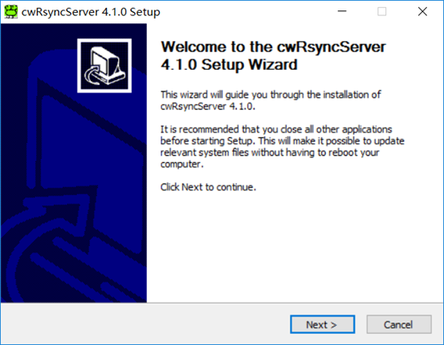
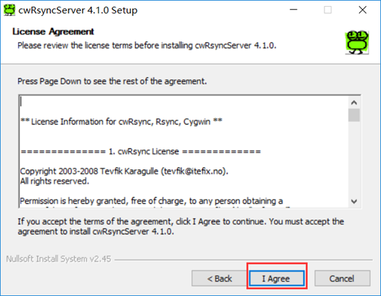
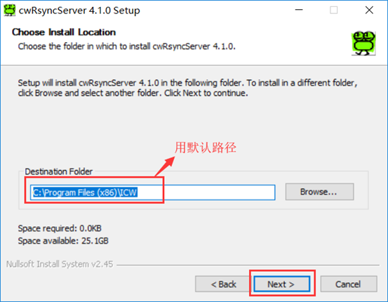
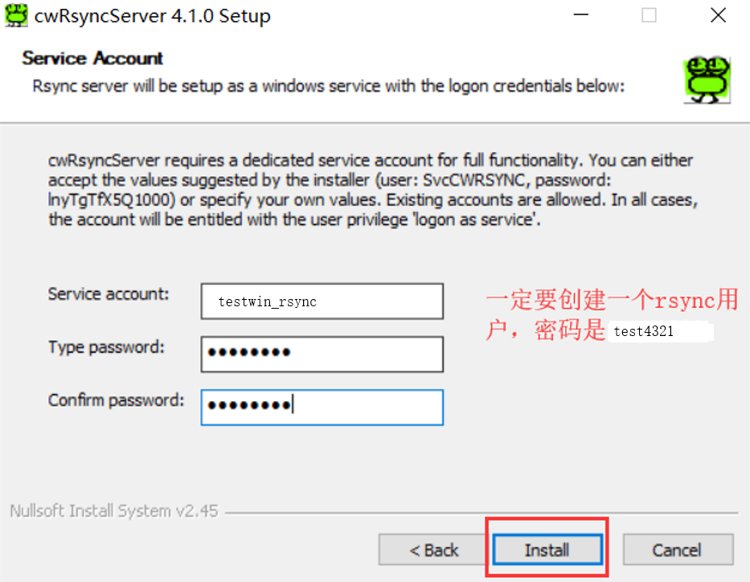
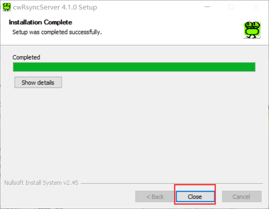
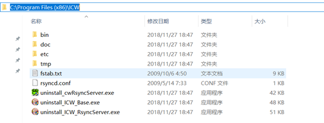
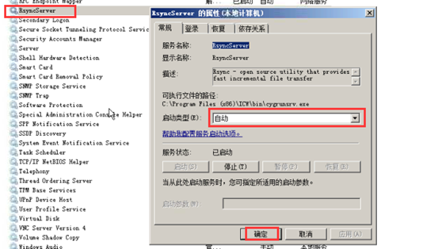
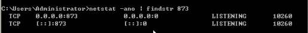

# 92.自己搭建rsync服务器-windows-linux
[TOC]

## windows10下搭rsync服务器并同步yum服务器
一：环境
　　1、同步对象：测试数据
　　2、服务端：Windows Server 2008 R2
　　3、客户端：Windows7 旗舰版64位
　　4、服务端rsync版本：cwRsyncServer_4.1.0_Installer.exe
　　5、rsync客户端和服务端下载链接
　　　　链接：https://pan.baidu.com/s/1kHQSVEODxbtXpxxMnT1S2A
　　　　提取码：9q4m
              或网盘huodeing7中rsync_tools
              链接: https://pan.baidu.com/s/1eJ7dpDeRRT7huHlZMClJTA 提取码: vqrp 

二：服务端安装指南



我用的路径是 D:/ProgramFiles/ICW

注意下图的用户名。



三：服务端配置
1、服务端目录结构如下

2、修改服务端rsyncd.conf,注意把所有注释去掉，我弄了半天。。。才发现
```shell
use chroot = false
strict modes = false
uid = 0# 0代表不限定用户
gid = 0
log file = rsyncd.log
[testwin]
path = /cygdrive/d/u01/nc_backup/# 和linux不同的是windows的备份目录前面都要加/cygdrive
ignore errors
read only = false
transfer logging = yes
auth users = test_rsync # rsync的虚拟用户
secrets file = etc/rsyncd.password # rsync的密码文件路径
hosts allow = * # 所有主机均可访问
```
我实际测试配置的rsyncd.conf文件内容如下
```shell
use chroot = false
strict modes = false
uid = 0
gid = 0
log file = rsyncd.log
[testwin]
path = /cygdrive/e/work/
ignore errors
read only = false
transfer logging = yes
auth users = test_rsync
secrets file = rsyncd.password
hosts allow = *
```
3、在etc目录下创建rsync.password文件
内容为：test_rsync:test4321

4、启动服务，修完成之后启动服务

5、检查端口

四：客户端同步服务端数据
```shell
# --password-file=rsync.password 客户机上的密码文件
# test_rsync@192.168.4.12::testwin 用户名@192.168.4.12::rsyncd.conf中的那个连接节点[testwin]
rsync.exe -avz --password-file=rsync.password test_rsync@192.168.4.12::testwin /cygdrive/f/testwin_rsyncdir
```
注意：客户端执行的时候要在客户端的bin目录下，还有一种方式可以配环境变量

### 把yum同步到本机中
```shell
#如果没配置path，DOS切换到安装目录中(我的D:\ProgramFiles\cwRsync\bin)执行
cd /d D:\ProgramFiles\cwRsync\bin
rsync -avz --progress --no-motd  rsync://mirrors.163.com/centos/8.2.2004/AppStream/x86_64/  /cygdrive/e/yum_data/centos/8.2.2004/AppStream/x86_64/
rsync -avz --progress --no-motd  rsync://mirrors.163.com/centos/8.2.2004/BaseOS/x86_64/ /cygdrive/e/yum_data/centos/8.2.2004/BaseOS/x86_64/
rsync -avz --progress --no-motd  rsync://mirrors.163.com/centos/8.2.2004/PowerTools/x86_64/ /cygdrive/e/yum_data/centos/8.2.2004/PowerTools/x86_64/
rsync -avz --progress --no-motd  rsync://mirrors.163.com/centos/8.2.2004/extras/x86_64/ /cygdrive/e/yum_data/centos/8.2.2004/extras/x86_64/
rsync -avz --progress --exclude=debug --no-motd rsync:/mirror.tuna.tsinghua.edu.cn/epel/8/Everything/x86_64/ /cygdrive/e/yum_data/epel/8/Everything/x86_64/
rsync -avz --progress --exclude=debug --no-motd rsync://mirror.tuna.tsinghua.edu.cn/epel/8/Modular/x86_64/ /cygdrive/e/yum_data/epel/8/Modular/x86_64/
rsync -avz --progress --exclude=rhel/7/SRPMS --no-motd rsync://mirror.tuna.tsinghua.edu.cn/zabbix/ /cygdrive/e/yum_data/zabbix/
```

## CentOS8下搭建
一，查看本地centos的版本:
```shell
cat /etc/redhat-release  #CentOS Linux release 8.2.2004 (Core) 
```
二，查看是否已安装rsync程序包？
```shell
rpm -qa | grep rsync #rsync-3.1.3-7.el8.x86_64
```
三，如果没安装，用下面的命令安装:
```install
yum install rsync
```
四，创建目录和密码文件:
```shell
#mkdir /data/rsync
#cd /data/rsync/
#mkdir run
#chmod 777 run
mkdir -m 777 /data/rsync/run
#mkdir log
#chmod 777 log
mkdir -m 777 /data/rsync/log
#mkdir conf
#chmod 777 conf
mkdir -m 777 /data/rsync/conf
#cd conf/
 #vi server.pass #文件中写入用户名:密码，内容为 huodeming:123456
echo "huodeming:123456" > /data/rsync/conf/server.pass
#密码文件的权限一律切换为 600，也可以在后面做
chmod 600 /data/rsync/conf/server.pass
```

五, 配置rsync服务的配置文件
```shell
vi /etc/rsyncd.conf
#文件内容如下============
uid = root
gid = root
port = 873
#use chroot = no            #是否可以改变同步的根目录
#read only = yes            #只读或者可以上传文件
#hosts allow=192.168.1.220
#hosts deny=*
# transfer logging = yes
#motd file = /data/rsync/conf/motd
# log format = %t %a %m %f %b
# syslog facility = local3
# timeout = 300
max connections = 200
pid file = /data/rsync/run/rsyncd.pid
lock file = /data/rsync/run/rsync.lock
log file = /data/rsync/log/rsyncd.log

[wwwroot]
path = /data/nfs/dest #需要给客户机同步的目录
comment = lg69_rsync
#read only = yes #只读
read only = no
auth users = pusher #登陆用户，与/data/rsync/conf/server.pass中用户名相同
secrets file = /data/rsync/conf/server.pass #用户文件，权限必须为600，内容: 用户名:密码
hosts allow  = 127.0.0.1,192.168.1.0/24,59.151.1.0/24,211.151.133.0/24,58.221.35.0/24,125.76.249.0/24 #不做IP限制可以不写，网上看到的
# list=yes
# ignore errors
# exclude = test/ test.php
```
我实测成功的配置文件/etc/rsyncd.conf
```shell
uid = root
gid = root
port = 873
max connections = 200
pid file = /temp/rsync/run/rsyncd.pid
lock file = /temp/rsync/run/rsync.lock
log file = /temp/rsync/log/rsyncd.log

[wwwroot]
path = /www/wwwroot/192.168.0.102/yum_data/
comment = lg69_rsync
#read only = yes
read only = no
auth users = huodeming
secrets file = /temp/rsync/conf/server.pass
hosts allow = 127.0.0.1,192.168.1.0/24,192.168.0.0/24,192.168.203.0/24
# list=yes
# ignore errors
# exclude = test/ test.php
```
六，生成rsync客户端密码文件及配置各密码文件权限
```shell
#在客户机上生成，别的地方也行，记得密码文件权限是600
#vi /temp/rsync/conf/client.pass #文件中写入内容为密码:123456
#chmod 600 /temp/rsync/conf/client.pass
echo "123456" > /data/rsync/conf/client.pass
#密码文件的权限一律切换为 600，也可以在后面做
chmod 600 /data/rsync/conf/client.pass
```
密码文件的权限一律切换为 600，如果前面没设置，在这做下,我服务器与客户机同一机子，所以两文件放一起了。
```shell
chmod 600 /temp/rsync/conf/*
#-rw------- 1 root root  7 10月  5 16:21 client.pass
#-rw------- 1 root root 17 10月  5 15:57 server.pass
```
七，服务器上启动rsync的服务
```shell
rsync --version #无关紧要
rsync --daemon # 启动rsync服务，注意开防火墙端口
lsof -i :873 # 查看837端口的进程占用情况
#COMMAND  PID USER   FD   TYPE DEVICE SIZE/OFF NODE NAME
#rsync   2999 root    4u  IPv4  41599      0t0  TCP *:rsync (LISTEN)
#rsync   2999 root    5u  IPv6  41600      0t0  TCP *:rsync (LISTEN)

kill 2999 #想要停掉服务  直接kill进程id
```

八，用systemctl管理rsync服务
1,创建一个配置文件
```shell
#vi /etc/sysconfig/rsyncd
#内容为：
#OPTIONS=""
echo "OPTIONS=\"\"" > /etc/sysconfig/rsyncd
```
2,创建service文件
```shell
vi /lib/systemd/system/rsyncd.service
# 内容为:
[Unit]
Description=fast remote file copy program daemon
ConditionPathExists=/etc/rsyncd.conf
[Service]
EnvironmentFile=/etc/sysconfig/rsyncd
ExecStart=/usr/bin/rsync --daemon --no-detach "$OPTIONS"
[Install]
WantedBy=multi-user.target
```
3,测试启动:
```shell
systemctl start rsyncd
systemctl stop rsyncd
```
九，启动rsync服务后，客户端测试同步一个目录到本地
```shell
[root@localhost conf]# rsync -vzrtopg --progress --password-file=/data/rsync/conf/client.pass pusher@127.0.0.1::wwwroot /data/nfs/test
#我自己在WINDOWS10测试的，没问题，注意WINDOWS下与LINUX下的写法区别
rsync -vzrtopg --progress --password-file=client.pass huodeming@192.168.0.105::wwwroot /cygdrive/e/temp
```
windows下客户端下载参见: https://www.cnblogs.com/zhangweiyi/p/10571273.html　　
链接：https://pan.baidu.com/s/1kHQSVEODxbtXpxxMnT1S2A
提取码：9q4m

### rsync关于auth failed on module xxx的解决方法
关于这个auth失败的问题，有以下可能的情况：

1、密码输入错误：
请再次确认你登录用户的密码无误

2、secrets file格式错误：
secrets file的文件格式是  upload:123456
表示upload用户的rsync密码是123456

3、配置文件写错：
最坑爹的一个，看看自己模块配置下面的auth users、secrets file有没写错

4、secrets file权限问题
服务端的secrets file权限必须是600，
可以使用chmod 600 /home/user/test/rsync/etc/test.pass

5、secrets file文件拥有者与rsync运行者
服务端rsync服务是以什么用户运行，则必须保证secrets file文件拥有者必须是同一个
假设root运行rsync --daemon，则secrets file的owner也必须是root

6、如果是以--password-file=file的方式附带密码
确保客户端密码文件格式无误，与服务端的密码文件不同，
客户端的不用加上用户名，即直接是  123456

7、可以尝试使用本地存在的用户名作为auth users
这个是在网上看到的，没实践过，不过如果都没办法，可尝试一下，
密码不要跟本地用户的系统密码一样就行了。
-----------------------------
最后如果还搞不清是什么问题，可以尝试从下面的思路去摸索：

1、在rsync模块的配置文件里，把strict modes设置为no，禁用文件mode检验

2、ssh、telnet登录rsync服务端，查看服务器端的rsync日志，这个通常会比客户端的信息多