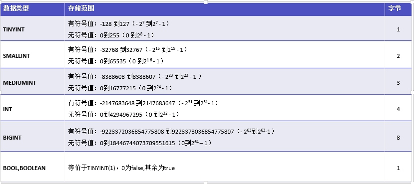
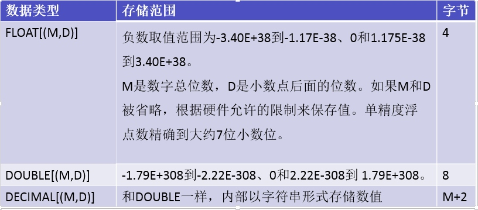
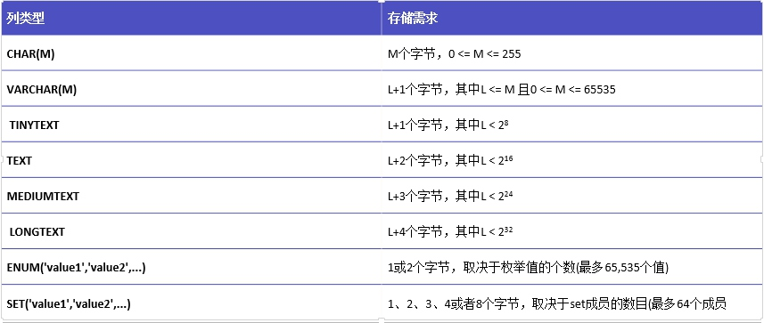
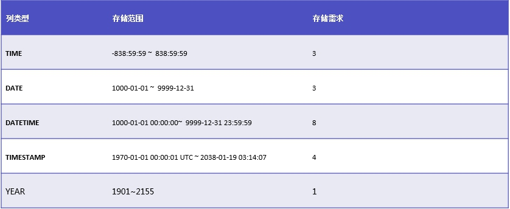

# 数据表操作
[TOC]

## 数据类型
### 数字类型:整型


>注意:mysql中没有BOOL 或 BOOLEAN类型,以后开发中,用TINYINT(1)表示,0表示FALSE,其它1-9表示TRUE.

###　数字类型:小数型

注意在使用时别超出范围：(M,D):M表示总位数(不包含小数点),D表示小数位数.如:
```sql
-- 表示最大值有8位整数,2位小数:99999999.99
CREATE TABLE 表名(test DECIMAL(10,2));
```
其中DECIMAL或NUMERIC是精确型(它是用字符串形式存储数值)

### 数字类型 无符号UNSIGNED 零填充ZEROFILL
```sql
-- 无符号,最小值是0,没有负数,注意插入值.
CREATE TABLE 表名(test INT UNSIGNED);

-- 零填充,注意会自动(强制转换成无符号),如指定的长度(不指定则默认长度)不够在左边填充0
CREATE TABLE test3(test INT ZEROFILL);
-- 用上面语句创建表后,查看表结构
DESC test3;
/*
+-------+---------------------------+------+-----+---------+-------+
| Field | Type                      | Null | Key | Default | Extra |
+-------+---------------------------+------+-----+---------+-------+
| test  | int(10) unsigned zerofill | YES  |     | NULL    |       |
+-------+---------------------------+------+-----+---------+-------+
1 row in set (0.01 sec)
*/
```

### 字符串类型

>注意:CHAR与VARCHAR的区别:
> CHAR是定长字符串,VARCHAR是可变长字符串,在存储上,CHAR速度快,但存储不定长字符串时占用空间大,字符串长度不够时用空格填充,开中发用于存储一些定长字符串,如手机号11位,身份证号18位等,其余用VARCHAR.

#### text类型
TEXT类型是一种特殊的字符串类型。只能保存字符数据，而且不能有默认值,
```sql
CREATE TABLE 表名(test TEXT);
```

#### 枚举类型ENUM
最多可枚举65535个值.
```sql
CREATE TABLE test(test ENUM('value1','value2','value3'...); -- 最多65535个值,插入数据时只能选其一插放,
-- 在创建时,会忽略枚举值字符串后空格(但不去字符串前空格).
CREATE TABLE test4(test ENUM('value1','     value2','value3      '));
DESC test4;
-- 结果如下所示,value3后的空格自动去了,而value2前的空格还在.
/*
mysql> desc test4;
+-------+------------------------------------+------+-----+---------+-------+
| Field | Type                               | Null | Key | Default | Extra |
+-------+------------------------------------+------+-----+---------+-------+
| test  | enum('value1','  value2','value3') | YES  |     | NULL    |       |
+-------+------------------------------------+------+-----+---------+-------+
1 row in set (0.00 sec)
*/

-- 也可以用序号插入值.从1开始,到个数.超出范围会出错.
INSERT INTO test value('value1'); -- 插入value1
INSERT INTO test value(1); -- 插入value1
-- 注意,枚举类型不能插入没有举出的值,但NULL是个例外,可以插入
INSERT INTO test value(NULL); -- null大小写都可以.
```

#### 集合类型 SET
最多能设置64个集合成员.
```sql
CREATE TABLE test(test SET('value1','value2','value3','value4','value5')); -- 最多设置64个值
--插入数据时注意,用字符串插入,但也可以用二进制值插入
INSERT INTO test values('value1,value2,value4'); -- 字符串的顺序可以随便.在集合内就行
/*
mysql> select * from test;
+----------------------+
| test                 |
+----------------------+
| value1,value2,value4 |
+----------------------+
1 row in set (0.00 sec)
*/

-- 也可以用数值插入,以二进制理解,1+2+3 = 7,所以插入的也是value1,value2,value3
INSERT INTO test values(7);
/*
mysql> select * from test;
+----------------------+
| test                 |
+----------------------+
| value1,value2,value4 |
| value1,value2,value3 |
+----------------------+
2 rows in set (0.00 sec)
*/
```

###　日期时间类型

#### TIME类型
用来存储时间格式,注意范围.
```sql
CREATE TABLE test(test TIME);
-- 插入或更新数据时,注意以下四种格式
INSERT INTO test VALUES('15:24:12'); -- 得到:15:24:12
INSERT INTO test VALUES('15:24'); -- 得到:15:24:00 有分隔符
INSERT INTO test VALUES('1524'); -- 得到:00:15:24  没有分隔符
INSERT INTO test VALUES('1 15:24'); -- 得到:39:24:00  天数 时间,其中天数在0-24范围内.,时分秒在00-59范围内
```

#### YEAR类型
YEAR年份,一个整数值1901-2155.
```sql
-- 注意:插入值时格式问题,数字0表示0000年,字符串'0'或'00'-'69'表示2000-2069年,字符串'70'-'99'表示 1970-1999年.
CREATE TABLE test(test YEAR);
INSERT INTO test VALUES(0); -- 0000
INSERT INTO test VALUES('0'); -- 2000
INSERT INTO test VALUES('00'); -- 2000
INSERT INTO test VALUES('70'); -- 1970
```
#### DATETIME TIMESTAMP
DATETIME是标准的日期时间
在日期时间类型中,基本上可以用:current_time或者current_time()或者now()得到当前服务器系统时间。
```sql
CREATE TABLE `test2` (
  `t1` time DEFAULT NULL,
  `t2` date DEFAULT NULL,
  `t3` datetime DEFAULT NULL,
  `t4` timestamp NOT NULL DEFAULT CURRENT_TIMESTAMP ON UPDATE CURRENT_TIMESTAMP,
  `t5` year(4) DEFAULT NULL
) ENGINE=InnoDB DEFAULT CHARSET=utf8
--插入数据测试
INSERT INTO test2 VALUES(NOW(),NOW(),NOW(),NOW(),NOW());
/*
mysql> select * from test2;
+-----------+------------+---------------------+---------------------+------+
| t1        | t2         | t3                  | t4                  | t5   |
+-----------+------------+---------------------+---------------------+------+
| 11:52:32  | 2018-03-19 | 2018-03-19 11:52:32 | 2018-03-19 11:52:32 | 2018 |
+-----------+------------+---------------------+---------------------+------+
*/
```
timestamp类型
1. 占用4个字节
2. 允许为空值，但是不可以自定义值，所以为空值时没有任何意义。
3. TIMESTAMP值不能早于1970或晚于2037。这说明一个日期，例如'1968-01-01'，虽然对于DATETIME或DATE值是有效的，但对于TIMESTAMP值却无效，如果分配给这样一个对象将被转换为0。
4. 值以UTC格式保存（ it stores the number of milliseconds）
5. 时区转化 ，存储时对当前的时区进行转换，检索时再转换回当前的时区。
6. 默认值为CURRENT_TIMESTAMP()，其实也就是当前的系统时间。
7. 数据库会自动修改其值，所以在插入记录时不需要指定timestamp字段的名称和timestamp字段的值，你只需要在设计表的时候添加一个timestamp字段即可，插入后该字段的值会自动变为当前系统时间。
8. 默认情况下以后任何时间修改表中的记录时，对应记录的timestamp值会自动被更新为当前的系统时间。
9. 如果需要可以设置timestamp不自动更新。通过设置DEFAULT CURRENT_TIMESTAMP 可以实现。

注意:timestamp如果创创建时不指定任何约束,它自带默认值default current_timestamp与更改表时自动更新 on update time_timestamp 与非空 not null三个参数.
```sql
CREATE TABLE test8(test TIMESTAMP);
SHOW CREATE TABLE test8; -- 查看表创建信息如下,自带NOT NULL DEFAULT CURRENT_TIMESTAMP ON UPDATE CURRENT_TIMESTAMP三个完整性约束
/*
+-------+-----------------------------------------------------------------------
CREATE TABLE `test8` (
  `test` timestamp NOT NULL DEFAULT CURRENT_TIMESTAMP ON UPDATE CURRENT_TIMESTAMP) ENGINE=InnoDB DEFAULT CHARSET=utf8 |
*/
```
注意:在MYSQL5.5中,不支持如下格式,(两个timestamp列,一个字段用于记录创建时间,一个字段用于记录最后更改时间,但在MYSQL5.6中就完美支持.
```sql
-- 以下语句在MYSQL5.5下失败,在MYSQL5.6中成功
CREATE TABLE test6(
id INT PRIMARY KEY AUTO_INCREMENT   -- ID 自增主键
,test TIMESTAMP DEFAULT CURRENT_TIMESTAMP --记录插入数据时间
,test1 TIMESTAMP DEFAULT CURRENT_TIMESTAMP ON UPDATE CURRENT_TIMESTAMP -- 记录最后修改时间 
);
```


## 表引擎
存储引擎就是指表的类型。数据库的存储类型决定了表在计算机中的存储方式。用户可以根据不同的存储方式、是否进行事务处理等来选择合适的存储引擎。

如何查看MySQL的存储引擎?
查看MySQL支持的存储引擎：SHOW ENGINES; -- 如果查看不方便 加上 \G参数
```sql
SHOW ENGINES;
SHOW ENGINES \G;
```
查看默认的存储引擎：SHOW VARIABLES LIKE 'storage_engine'

MySQL常用引擎:
InnoDB:5.1以后版本默认引擎,支持事务
MyISAM:5.1以前版本默认引擎,不支持事务,速度快
MEMORY:内存表,速度超快,不支持事务,怕停止,用作于缓存等.

## 数据表操作
### 查看表信息命令
```sql
-- 查看创建信息
SHOW CREATE TABLE 表名;
-- 查看表结构信息
DESC 表名;
```
### 创表表 CREATE TABLE
#### 基本语法
```sql
-- 创建最简单的表
CREATE TABLE 表名;

-- 创建表时增加字段
CREATE TABLE kp_user_info(
id int auto_increment primary key
,uname varchar(20)
,age tinyint unsigned  default 1
,sex tinyint(1) default 0
,tel varchar(20)
,email varchar(50)
,addr varchar(200)
,qq varchar(15)
);
```
#### 建表时增加引擎与指定字符集
```sql
CREATE TABLE kp_user_info(id int, uname varchar(20)) ENGINE=innodb CHARSET=UTF8; --DEFAULT可以省略  ENGINE=innodb DEFAULT CHARSET=UTF8;
```
#### 添加键与约束
##### 主键 primary key
```sql
-- 创建表时增加主键
CREATE TABLE kp_user_info(
id int auto_increment primary key -- auto_increment 自动增长;primary key 主键
,uname varchar(20) 
) 
-- 第二种方法
CREATE TABLE kp_user_info(
id int auto_increment 
,uname varchar(20) 
,primary key (id) -- 增加主键,常用于创建多列主键
) 
```

##### 自动增长　auto_increment
```sql
CREATE TABLE kp_user_info(
id INT auto_increment  -- 自动增长
,age INT NOT NULL -- 在插入修改数据时必须有数据.不能是空的
) 
```

##### 默认值 DEFAULT
```sql
CREATE TABLE kp_user_info(
id int auto_increment 
,age int DEFAULT 1 -- 如果插入数据时没有此列数据,它就会用默认值.如果不写,默认是NULL
) 
```

##### 非空 NOT NULL
```sql
CREATE TABLE kp_user_info(
id INT auto_increment 
,age INT NOT NULL -- 在插入修改数据时必须有数据.不能是空的
) 
```
#####唯一 UNIQUE KEY
注意:与主键不同,一个表中可以有多个,UNIQUE KEY,可以省略KEY 写成UNIQUE.注意,NULL不在唯一约束中,可以有多个.
```sql
CREATE TABLE kp_user_info(
id INT UNIQUE KEY
,age INT NOT NULL -- 在插入修改数据时必须有数据.不能是空的
);
-- 第二种写法
CREATE TABLE test(
id INT 
,age INT
,UNIQUE KEY (id)
);
```

##### 外键约束  FOREIGN KEY (列名) REFERENCES 被关联表(被关联表的列名)
外键中的级联关系有以下几种情况：
ON DELETE CASCADE 删除主表中的数据时，从表中的数据随之删除
ON DELETE SET NULL 删除主表中的数据时，从表中的数据置为空
ON UPDATE CASCADE 更新主表中的数据时，从表中的数据随之更新
用法:在外键后面加上如下关键字,完成如下练习
```sql
[[ ON DELETE CASCADE ][ON DELETE SET NULL]] [ON UPDATE CASCADE]
-- 如下为练习表外键:
    -- 创建数据库
CREATE DATABASE kp_test DEFAULT CHARACTER SET UTF8 COLLATE UTF8_GENERAL_CI;

-- 选择数据库
USE kp_test;

-- 创建表

-- 1. 班级表,
CREATE TABLE kp_class(
id SMALLINT UNSIGNED PRIMARY KEY COMMENT '班级ID'
,classname VARCHAR(30) COMMENT '班级名'
) COMMENT '班级表';


-- 2.创建用户资料表
CREATE TABLE kp_user(
id INT PRIMARY KEY AUTO_INCREMENT COMMENT '学号,主键', 
useranme VARCHAR(20) COMMENT '姓名',
age TINYINT UNSIGNED COMMENT '年龄',
sex TINYINT(1) COMMENT '性别',
classid SMALLINT UNSIGNED COMMENT '班级ID',
tel VARCHAR(20) COMMENT '电话',
addr VARCHAR(200) COMMENT '地址',
email VARCHAR(100) COMMENT '邮箱',
FOREIGN KEY (classid) REFERENCES kp_class(id) ON DELETE CASCADE ON UPDATE CASCADE -- 测试本列在构建时不加删除与更新测试
) COMMENT '用户资料班';

-- 3.创建科目表
CREATE TABLE kp_subject(
id SMALLINT UNSIGNED PRIMARY KEY COMMENT '科目ID,主键'
,subname VARCHAR(50) COMMENT '科目名'
);

-- 4.创建成绩表
CREATE TABLE kp_score(
cid SMALLINT UNSIGNED COMMENT '科目ID',
uid INT COMMENT '外键,用户ID',
score1 DECIMAL(5,2) COMMENT '理论成绩',
score2 DECIMAL(5,2) COMMENT '上机成绩',
score DECIMAL(5,2) COMMENT '总成绩',
PRIMARY KEY (cid,uid),
FOREIGN KEY (uid) REFERENCES kp_user(id) ON DELETE CASCADE ON UPDATE CASCADE,
FOREIGN KEY (cid) REFERENCES kp_subject(id) ON DELETE CASCADE ON UPDATE CASCADE
); 

-- 插入数据
-- 1.班级数据
INSERT INTO kp_class VALUES(1,'鲲鹏一班');
INSERT INTO kp_class VALUES(2,'鲲鹏二班');
INSERT INTO kp_class VALUES(3,'鲲鹏三班');
INSERT INTO kp_class VALUES(4,'鲲鹏四班');
INSERT INTO kp_class VALUES(5,'鲲鹏五班');
INSERT INTO kp_class VALUES(6,'鲲鹏六班');
INSERT INTO kp_class VALUES(7,'鲲鹏七班');
INSERT INTO kp_class VALUES(8,'鲲鹏八班');
-- 2.科目数据
INSERT INTO kp_subject VALUES(1,'计算机基础CTB');
INSERT INTO kp_subject VALUES(2,'软件基础STB');
INSERT INTO kp_subject VALUES(3,'PHOTOSHOP');
INSERT INTO kp_subject VALUES(4,'HTML+CSS');
INSERT INTO kp_subject VALUES(5,'HTML5+CSS3');
INSERT INTO kp_subject VALUES(6,'JAVA基础');
INSERT INTO kp_subject VALUES(7,'MS-SQL');
INSERT INTO kp_subject VALUES(8,'C语言');
INSERT INTO kp_subject VALUES(9,'JAVASCRIPT');
INSERT INTO kp_subject VALUES(10,'PHP基础');
INSERT INTO kp_subject VALUES(11,'一年级上学期末');
INSERT INTO kp_subject VALUES(12,'一年级下学期末');
INSERT INTO kp_subject VALUES(13,'二年级上学期末');
INSERT INTO kp_subject VALUES(14,'二年级下学期末');
-- 3.用户数据
INSERT INTO kp_user values(1,'邓厚强','16','1','5','13838383838','邵阳','123456@qq.com');
INSERT INTO kp_user values(2,'孙涛','16','1','5','13838383838','邵阳','123457@qq.com');
INSERT INTO kp_user values(3,'王拓','16','1','5','13838383838','邵阳','123458@qq.com');
INSERT INTO kp_user values(4,'刘帅','16','1','5','13838383838','邵阳','123459@qq.com');
INSERT INTO kp_user values(5,'肖菲','16','0','5','13838383838','邵阳','123460@qq.com');
-- 4.成绩
INSERT INTO kp_score VALUES(1,1,20,40,60);
INSERT INTO kp_score VALUES(2,1,30,40,70);
INSERT INTO kp_score VALUES(3,1,40,40,80);
INSERT INTO kp_score VALUES(1,2,23,40,63);
INSERT INTO kp_score VALUES(2,2,33,40,73);
INSERT INTO kp_score VALUES(3,2,43,40,83);
INSERT INTO kp_score VALUES(1,3,24,40,64);
INSERT INTO kp_score VALUES(2,3,34,40,74);
INSERT INTO kp_score VALUES(3,3,44,40,84);
INSERT INTO kp_score VALUES(1,4,25,40,65);
INSERT INTO kp_score VALUES(2,4,35,40,75);
INSERT INTO kp_score VALUES(3,4,45,40,85);
INSERT INTO kp_score VALUES(1,5,26,40,66);
INSERT INTO kp_score VALUES(2,5,36,40,76);
INSERT INTO kp_score VALUES(3,5,46,40,86);

-- 第二大步:重新构建表,删除如下

DROP TABLE kp_score;
DROP TABLE kp_user;
DROP TABLE kp_class;
DROP TABLE kp_subject;
```


### 删除表 DROP TABLE
```sql
DROP TABLE 表名;
-- 一次删除多个表
DROP TABLE 表名,表名....;
-- 删除不存在的表时会报错,建议加上IF EXISTS后就好了
DROP TABLE IF EXISTS 表名,表名....;
```

### 修改表 ALTER TABLE
#### 修改表名 RENAME
```sql
ALTER TABLE 表名 RENAME [AS | TO] 新表名;
RENAME TABLE 表名 TO 新表名;
```
#### 增加字段 ADD
```sql
ALTER TABLE 表名 ADD 列名 列类型 [完整性约束] [位置FIRST| AFTER];
-- 在test表中增加col字段
ALTER TABLE test ADD col INT;
-- 一次增加多个字段
ALTER TABLE test ADD col INT,ADD col1 INT...;
-- 增加列时指定位置: 把col列放在开始位置,把col1列放在id列后面
ALTER TABLE test ADD col INT FIRST,ADD col1 INT AFTER id;
```
#### 删除字段 DROP
```sql
ALTER TABLE 表名 DROP 列名;
```

#### 修改字段 MODIFY
不包括索引与主键,外键
```sql
ALTER TABLE 表名 MODIFY 列名 类型 完整性约束 [位置 FIRST | AFTER 列名];
-- 修改列类型
ALTER TABLE test1 MODIFY addr VARCHAR(300) DEFAULT '邵阳';
-- 把addr列移动到id列后面.
ALTER TABLE test1 MODIFY addr VARCHAR(300) DEFAULT '邵阳' AFTER id;
```
#### 修改字段加强版(可重命名字段名) CHANGE
MODEFY的加强版
```sql
ALTER TABLE 表名 CHANGE 列名 新列名 类型 完整性约束 [位置 FIRST | AFTER 列名];
```
#### 添加或修改默认值 SET DEFAULT
```sql
ALTER TABLE 表名 ALTER 列名 SET DEFAULT 默认值;
```
#### 删除默认值 DROP DEFAULT
```sql
ALTER TABLE 表名 ALTER 列名 DROP DEFAULT;
ALTER TABLE 表名 ALTER 列名 SET DEFAULT NULL; -- 一般没默认值的就是NULL类型
```
#### 添加主键 ADD PRIMARY KEY
一个表只能有一个主键,在开发中而且建议必须给.
在后续用ALTER TABLE增加主键时,要注意如果表里有数据得符合主键要求.(NOT NULL且不能有重复数据)
```sql
ALTER TABLE 表名 ADD PRIMARY KEY (列名);
-- 完整语法
ALTER TABLE 表名 ADD CONSTRAINT symbol PRIMARY KEY index_type(列名);
```
#### 删除主键 DROP PRIMARY KEY
```sql
ALTER TABLE 表名 DROP PRIMARY KEY;
-- 一般主键与自增长一起使用,要删除主键,必须先去掉自增长.
ALTER TABLE test1 MODIFY id int unsigned; -- 也可以用CHANGE关键字
```
#### 添加唯一键 ADD INIQUE [INDEX|KEY]
```sql
ALTER TABLE 表名  ADD UNIQUE [INDEX|KEY] [索引名](列名);
```
#### 删除唯一键 DROP [INDEX|KEY] index_name
```sql
ALTER TABLE 表名  DROP  {INDEX|KEY} [索引名];
-- 当不知道键名时,用SHOW CREATE TABLE 表名;查看索引名
```
#### 修改表存储引擎 ENGINE=InnoDB
```sql
ALTER TABLE 表名 ENGINE=引擎名;
```

#### 修改表字符集 DEFAULT CHARACTER SET
```sql
ALTER TABLE table_name DEFAULT CHARACTER SET utf8;
```
#### 修改表自增起始值 AUTO_INCREMENT=值
```sql
ALTER TABLE tbl_name AUTO_INCREMENT=值;
-- 注意,在创建表时如果不指定表的自增长最小值,默认从1开始,也不会显示表的AUTO_INCREMENT属性.
-- 1.创建好表
CREATE TABLE test2(id INT UNSIGNED KEY AUTO_INCREMENT,uname varchar(20));
-- 2.查看它的创建信息:看不到表有AUTO_INCREMENT=值.
SHOW CREATE TABLE test2;
/*
CREATE TABLE `test2` (
  `id` int(10) unsigned NOT NULL AUTO_I
  `uname` varchar(20) DEFAULT NULL,
  PRIMARY KEY (`id`)
) ENGINE=InnoDB DEFAULT CHARSET=utf8 |
*/
-- 3.我们往表中插入数据
INSERT INTO test2(uname) VALUES('aa');
-- 4.我们再次查看表创建信息:多出来: AUTO_INCREMENT=2  就是告诉我们下一次插入数据自增列的值是2
SHOW CREATE TABLE test2;
/*
CREATE TABLE `test2` (
  `id` int(10) unsigned NOT NULL AUTO_INCREMENT,
  `uname` varchar(20) DEFAULT NULL,
  PRIMARY KEY (`id`)
) ENGINE=InnoDB AUTO_INCREMENT=2 DEFAULT CHARSET=utf8
*/
-- 5.修改表的自增最小值:(自增列下一次插入数据的默认值)
ALTER TABLE tbl_name AUTO_INCREMENT=500;
-- 6.用SHOW CREATE TABLE  表名;查看表创建信息....同时插入新的数据去测试.
```


