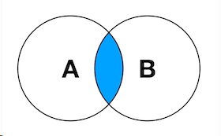
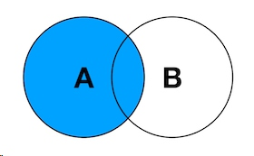
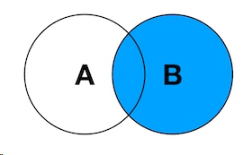

#  08.多表连接查询
[TOC]

## 内连接[INNER] JOIN
内连接（inner join）:产生的结果是A和B的交集（相同列里面的相同值,A表要有,B表也要有才显示）
内连接查询能将左表和右表中能关联起来的数据连接后返回，返回的结果就是两个表中所有相匹配的数据。

```sql
SELECT * FROM 表1 [INNER] JOIN 表2 ON 表1.列名 = 表2.列名;
-- 下面语句不规范的写法,来源于早期版本,注意下.
SELECT * FROM 表1,表2 WHERE 表1.列名 = 表2.列名;
```
## 外连接
内连接是要显示两张表的内存，而外连接不要求如此，外连接可以依据连接表保留左表，右表或全部表的行为而分为左外连接右外连接和全连接。
> 注意,在MYSQL中,外连接分为左连接(LEFT JOIN)与右连接(RIGHT JOIN),没有全连接(FULL [OUTER] JOIN).

### 左连接 LEFT JOIN
Left Join:产生表B的完全集，而A表中匹配的则有值（没有匹配的则以null值取代）

```sql
SELECT * FROM 表1 LEFT JOIN 表2 ON 表1.列名 = 表2.列名;
```

### 右连接 RIGHT JOIN
Right Join:产生表A的完全集，而B表中匹配的则有值（没有匹配的则以null值取代）


```sql
SELECT * FROM 表1 RIGHT JOIN 表2 ON 表1.列名 = 表2.列名;
```

## [理解]笛卡尔积：CROSS JOIN
不用记语法,只要用JOIN时,不加ON A.列名 = B.列名.它查出来的结果就是笛卡尔积,它更像是一个BUG.

## 多表进行连接
多表进行连接查询时,尽量加上别名,要注意字段的选择.用 `表别名.列名`,条件中也用`表别名.列名`.
```sql
-- 查询用户表,显示孙涛的所有科目成绩
SELECT
a.id,a.uname,c.sname,b.sum  -- 注意别用关键字做为列名,如sum
FROM 
kp_user_info AS a 
LEFT JOIN kp_score AS b on a.id = b.uid
LEFT JOIN kp_subject AS c on b.subid = c.id  
WHERE a.uname ='孙涛';

-- 注意多种写法,表顺序的问题
-- 注意:从语义上看,好像会显示kp_score的所有行,但实际上与上面语句一样的.只显示孙涛用户的成绩.(WHERE是把三表连接起来后(一个整体虚拟表一样)再进行条件筛选).
SELECT
b.id,b.uname,c.sname,a.sum -- -- 注意别用关键字做为列名,如sum
FROM
kp_score AS a
LEFT JOIN kp_user_info AS b ON a.uid = b.id 
LEFT JOIN kp_subject AS c ON a.subid = c.id
WHERE b.uname = '孙涛';

-- 上面语句可以写成如下样子.把条件放在kp_user_info表中,用右连接
SELECT
b.id,b.uname,c.sname,a.sum
FROM
kp_score AS a
RIGHT JOIN (select * from kp_user_info WHERE uname = '孙涛') AS b ON a.uid = b.id 
LEFT JOIN kp_subject AS c ON a.subid = c.id;


```