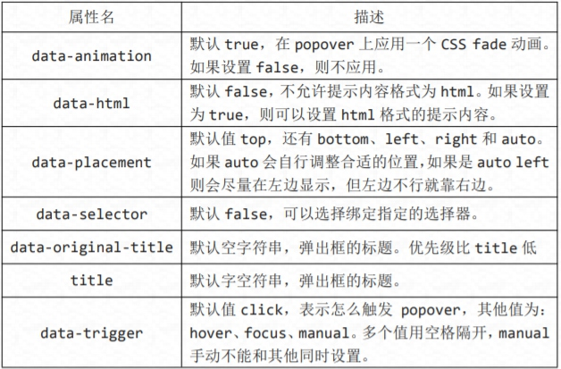
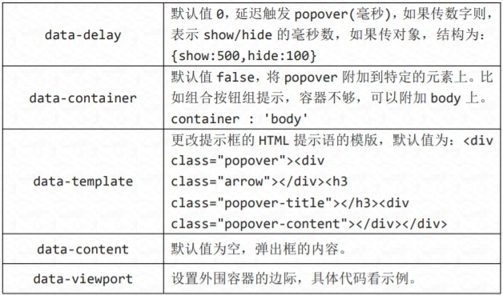

# 弹出框和警告框插件
[TOC]

## 弹出框
弹出框即点击一个元素弹出一个包含标题和内容的容器。
//基本用法
```html
<button class="btn btn-lg btn-danger" type="button" data-toggle="popover" title="弹出框" data-content="这是一个弹出框插件">点击弹出/隐藏弹出框</button>
```
//JavaScript 初始化
```javascript
$('button').popover();
```
弹出框插件有很多属性来配置提示的显示，具体如下：



```javascript
$('button').popover({
container : 'body',
viewport : {
selector : '#view',
padding : 10,
}
});
```
通过 JavaScript 执行的方法有四个。
//显示
```javascript
$('button').popover('show');
```
//隐藏
```javascript
$('button').popover('hide');
```
//反转显示和隐藏
```javascript
$('button').popover('toggle');
```
//隐藏并销毁
```javascript
$('button').popover('destroy');
```
Popover 插件中事件有四种。
```table
事件类型| 描述
show.bs.popover |在调用 show 方法时触发
shown.bs.popover| 在显示整个弹窗时时触发
hide.bs.popover| 在调用 hide 方法时触发
hidden.bs.popover |在完全关闭整个弹出时触发
```
//事件，其他雷同
```javascript
$('button').on('show.bs.tab', function () {
alert('调用 show 方法时触发！');
});
```

## 警告框
警告框即为点击小时的信息框。
//基本实例
```html
<div class="alert alert-warning">
<button class="close" type="button" data-dismiss="alert">
<span>&times;</span>
</button>
<p>警告：您的浏览器不支持！</p>
</div>
```
//添加淡入淡出效果
```html
<div class="alert alert-warning fade in">
```
如果用 JavaScript，可以代替 data-dismiss="alert"
//JavaScript 方法
```javascript
$('.close').on('click', function () {
$('#alert').alert('close');
})
```

Alert 插件中事件有两种。
```table
事件类型 描述
close.bs.alert |当 close 方法被调用后立即触发
closed.bs.alert| 当警告框被完全关闭后立即触发
```
//事件，其他雷同
```javascript
$('#alert').on('close.bs.alert', function () {
alert('当 close 方法被触发时调用！');
});
```
