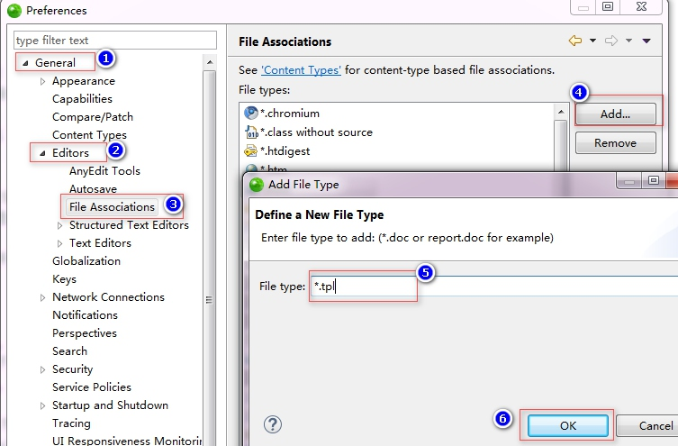
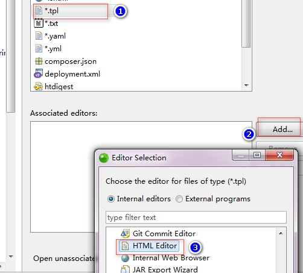
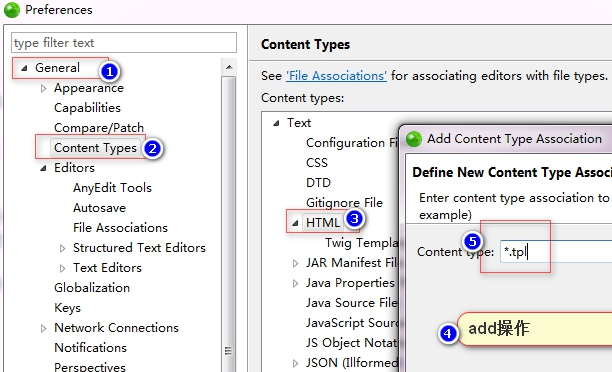

# 10.ThinkPHP-视图
[TOC]

本节课，我们将要学习一下 ThinkPHP 视图，视图是 Web 的可见内容，一般是 HTML结合 PHP 获取的数据提供给用户使用的部分，属于 MVC 中的 V。

## 一．模版定义
模版在使用之前需要一定的设置，才能方便开发者使用。每个模块的模版文件是独立的，为了对模版文件更加有效的管理，ThinkPHP 对模版文件机型目录划分，默认的模版文件定义规则是：
视图目录/[模版主题/]控制器名/操作名+模版后缀
第一步：在 User 控制器模块执行一条语句：
```php
//渲染模版输出
$this->display();
```
什么都没有定义的情况下，会自动报错，错误信息提示如下：
模板不存在:./Weibo/Home/View/User/index.html
通过这个错误提示，我们只要在 View 目录下创建 User 目录，并在 User 目录下创建index.html 文件，这时模版渲染模版输出成功。
默认情况下视图目录是 View，如果你想改变成别的目录名可以设置：
```php
//修改模版的视图目录
'DEFAULT_V_LAYER' =>'Template', 
//修改模版中的文件的后缀,默认情况下的模版文件后缀是.html，如果你想改变成别的后可以设置：
'TMPL_TEMPLATE_SUFFIX'=>'.tpl'
```
如果感觉每一个模块，都要创建相应的目录太过于麻烦，可以设置：
```php
//用下划线代替目录层次,不建议用
'TMPL_FILE_DEPR'=>'_', //模板不用建目录,用下划线形式:User_index.tpl
```
如果不想将模版存在在当前 Weibo 目录下，而设置在外部：
```php
//设置外部的模版目录,根目录下的public目录.记得里面分模块目录,如home,admin等子目录.
'VIEW_PATH'=>'./Public/', 
//设置默认主题目录,如果一个系统要考虑多套界面皮肤的话，要考虑到默认皮肤以及可选皮肤：
'DEFAULT_THEME'=>'default',
//切换主题
$this->theme('blue')->display();
```
## 配置zend studio对tpl文件的默认编辑器
1.增加一个文件类型

2.为tpl文件增加编辑器

3.把tp.文件关联到HTML类型下面.



## 二．赋值和渲染
如果要在模版中输出变量，必须在控制器中把变量传递给模版。ThinkPHP 提供了assign 方法对模版变量赋值，无论何种变量类型都统一使用 assign 赋值。
```php
//给模版传递一个变量
$this->assign('user', '蜡笔小新');
```
```html
//模版中调用变量
{$user}
```
PS：这个方法必须在 display()方法之前使用，保存变量正确传递。
渲染模版输出使用的是 display 方法，有三个可选参数：
display([模版文件][,字符编码][,输出类型]);
如果不传递任何参数，它会按照默认的目录定位模版的位置：
当前模块/默认视图目录/当前控制器/当前操作.html
```php
//不传参数
$this->display();
//./Weibo/Home/View/default/User/index.tpl
//修改默认模版
$this->display('add');
//./Weibo/Home/View/default/User/add.tpl
//修改默认模版，目录加模版  [控制器/方法名] 或 [控制器:方法名]
$this->display('Bbb/add');
//./Weibo/Home/View/default/Bbb/add.tpl
//修改默认模版，模块加目录加模版
//修改默认模版，[模块名@控制器名:方法名]或[模块名@控制器名/方法名] 注意,上面不要有$this->show()方法..否则不生效
$this->display('Admin@Bbb/add');
//./Weibo/Admin/View/default/Bbb/add.tpl
//修改默认模版，主题加目录加模版
$this->theme('blue')->display('Bbb/add');
//./Weibo/Home/View/blue/Bbb/add.tpl
//修改默认模版，自定义模版,相当于index.php目录下的Template/Public/add.tpl文件.测试时不要被报错的URL迷惑
//模板不存在:./Kpit/Home/View/./Template/Public/add.tpl.html
//其实 ./Template/Public/add.tpl其实是一个完整的地址.(真实的路径是index.php同级目录/Template/Public/add.tpl才对.)
$this->display('./Template/Public/add.tpl');
//./Template/Public/add.tpl //Template 和 Weibo 同级
//修改默认模版，指定编码和文件类型，一般不用填写，默认即可
$this->display('add', 'utf-8', 'text/xml');
```

## 三．模版地址
ThinkPHP 封装了一个 T 函数，专门用于生成模版文件的URL。格式如下：
**T([资源://][模块@][主题/][控制器/]操作,[视图分层]);**
```php
//输出当前模版地址
echo T();//输出:  ./Kpit/Home/View/User/user.html
```
当然可以结合上面讲的所有定义方法来自定义模版：
```php
echo T('Public/add')
echo T('Admin@index');//去Aadmin模块下找模板
echo T('Admin@Public/add', 'Template');//去Admin模块下的View目录下的Public目录下找模板,相当于模块
//直接使用T函数输出
$this->display(T());
```

## 四．获取内容
如果需要获取模版的内容，可以使用 fetch()方法，这个方法的使用和 display()方法一致,换种说法,display方法就是fetch与show方法的结合体。
```php
//获取模版里的内容
$content = $this->fetch();
var_dump($content);//得到模板的HTML文件内容,相当于读取文件内容并替换变量等.
//通过内容再渲染输出
$this->show($content);//把模板中的变量等替换后的内容输出到最终文件并显示.
```
>PS：使用 fetch()方法获取内容，主要是为了可以处理和过滤更加复杂的内容。然后
处理后再由 show()方法输出。