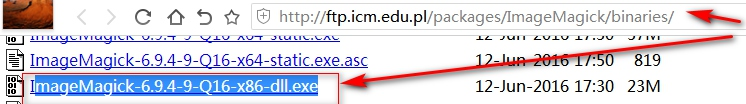
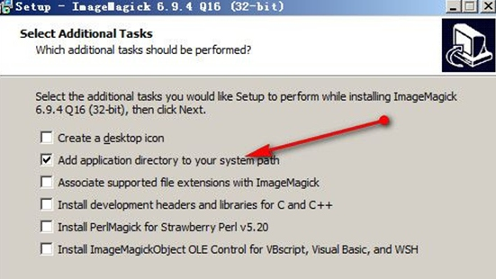
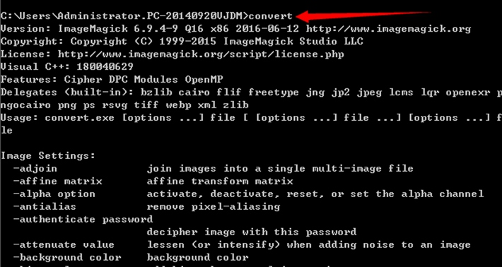
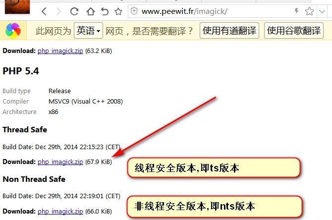
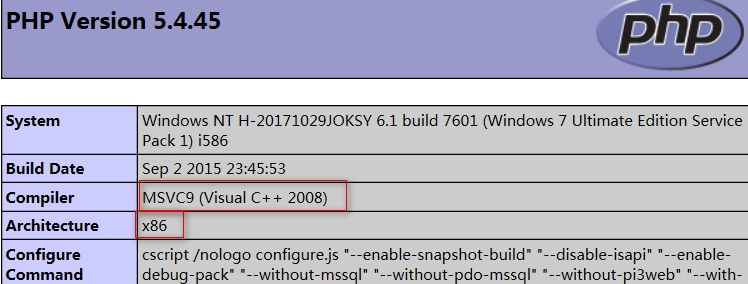
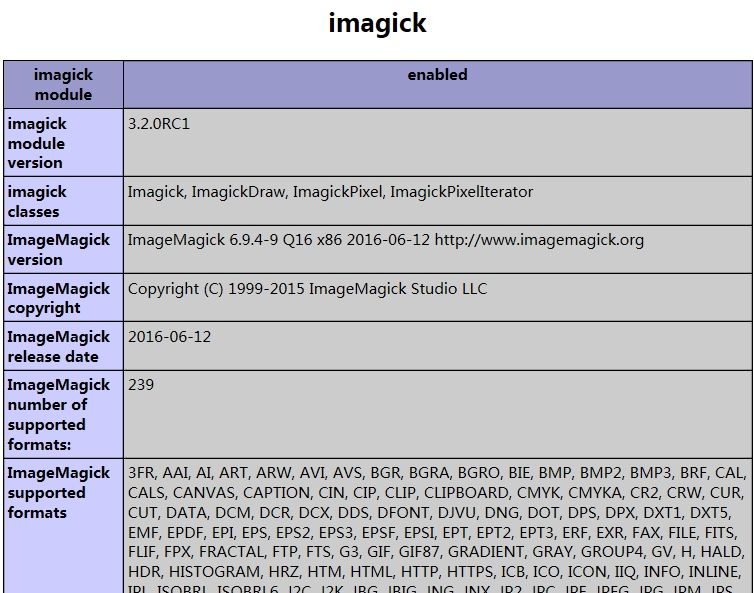

# 18.ThinkPHP图像处理
[TOC]

本节课，我们将要学习一下 ThinkPHP 的图像处理功能，即 Image.class.php。支持GD 库和 Imagick 库，包括对 GIF 图像处理的支持。

## 一．实例化类库
//实例化图像处理类，默认为GD库
```php
$image = new Image();
```
//采用Imageick扩展库，默认没安装,需安装
```php
$image = new Image(Image::IMAGE_IMAGICK);
$image = new Image('Imagick');//实测3.2.3版本不支持这种写法,请用上面的就OK,或直接用数字2
```
PS：Imageick 扩展库在处理更加复杂的图像上具有很强的优势，但如果只是一些普通的需求，使用 GD 库完全够用。

## 二．获取图像信息
我们讲一张图片保存在 Public 公共目录下，命名为：1.jpg。首先，通过 Image 打开
图像。
//实例化图象处理类库
```php
$image = new Image();
```
//加载一张预处理的图片
```php
$image->open('./Public/1.jpg');
```
//上面两句，可以用一句话包含
```php
//$image = new Image(Image::IMAGE_GD, './Public/img/001.jpg');
//我安装了Imagick之后
//$img = new Image(Image::IMAGE_IMAGICK);//Image::IMAGE_IMAGICK它的值就是2
$image = new Image(2);
$image->open('./Public/img/001.jpg');
```
//获取图片信息
```php
$arr['width'] = $image->width(); //得到宽度
$arr['height'] = $image->height();//得到高茺
$arr['type'] = $image->type();//得到类型
$arr['mime'] = $image->mime();//得到类型的mime
$arr['size'] = $image->size();//得到宽度与高度的数组
var_dump($arr);
/*
Array(
    [width] => 960
    [height] => 800
    [type] => jpeg
    [mime] => image/jpeg
    [size] => Array(
            [0] => 960
            [1] => 800
        )
    )
*/
```

## 三．图像处理
### 裁剪crop()
使用 crop()和 save()方法可以实现图像的裁剪功能。
//裁剪图片，高400，宽400
```php
$image->crop(400,400)->save('./Public/2.jpg');
```
//裁剪图片，坐标100,100开始裁剪
```php
$image->crop(400,400,100,100)->save('./Public/2.jpg');
```
//裁剪图片，生成后的图片压缩成高宽200
```php
$image->crop(400,400,100,100,200,200)->save('./Public/2.jpg');
```
实例代码:
```php
//$img = new Image(Image::IMAGE_IMAGICK);
$image = new Image(2);

$image->open('./Public/img/001.jpg');

$arr['width'] = $image->width();
$arr['height'] = $image->height();
$arr['type'] = $image->type();
$arr['mime'] = $image->mime();
$arr['size'] = $image->size();
print_R($arr);

//裁剪图片
$image->crop(400, 400)->save('./Public/img/001_new.jpg');

//裁剪图片,居中裁剪(大图宽度/2-小图宽度/2)
$image->crop(400, 400,($image->width()-400)/2,($image->height()-400)/2)->save('./Public/img/001_new1.jpg');

//裁剪图片,居中裁剪,并保存为缩略图50*50
$image->crop(400, 400,$image->width()/2-400/2,$image->height()/2-400/2,50,50)->save('./Public/img/001_new2.jpg');
```

### 缩略图 thumb()
使用 thumb 方法生成缩略图。
//生成缩略图
```php
$image->thumb(300,300)->save('./Public/2.jpg');
```
PS：虽然我们设置了宽高 300，但实际上它是 300 x 168，因为生成缩略图采用默认等比例缩放的。如果想用其它缩略图模式，可以使用以下方式。
```
IMAGE_THUMB_SCALE = 1 ; //等比例缩放类型
IMAGE_THUMB_FILLED = 2 ; //缩放后填充类型
IMAGE_THUMB_CENTER = 3 ; //居中裁剪类型
IMAGE_THUMB_NORTHWEST = 4 ; //左上角裁剪类型
IMAGE_THUMB_SOUTHEAST = 5 ; //右下角裁剪类型
IMAGE_THUMB_FIXED = 6 ; //固定尺寸缩放类型,图片可能会变形
```
//生成缩略图，以中心点截取，直接传3也可以
```php
$image->thumb(300,300,Image::IMAGE_THUMB_CENTER)->save('./Public/2.jpg');
```

### 水印 water()
使用 water()方法可以生成一张包含水印的图片。
//在图片右下角添加水印并生成
```php
$image->water('./Public/logo.png')->save('./Public/2.jpg');
```
由于默认是右下角水印位置，如果想更改水印位置，可以在第二参数使用如下：
```php
IMAGE_WATER_NORTHWEST = 1 ; //左上角水印
IMAGE_WATER_NORTH = 2 ; //上居中水印
IMAGE_WATER_NORTHEAST = 3 ; //右上角水印
IMAGE_WATER_WEST = 4 ; //左居中水印
IMAGE_WATER_CENTER = 5 ; //居中水印
IMAGE_WATER_EAST = 6 ; //右居中水印
IMAGE_WATER_SOUTHWEST = 7 ; //左下角水印
IMAGE_WATER_SOUTH = 8 ; //下居中水印
IMAGE_WATER_SOUTHEAST = 9 ; //右下角水印
```
//更改水印到左上角
```php
$image->water('./Public/logo.png', Image::IMAGE_WATER_NORTHWEST)->save('./Public/2.jpg');
```
//设置水印的透明度，默认为80，1-100之间
```php
$image->water('./Public/logo.png', Image::IMAGE_WATER_NORTHWEST, 30)->save('./Public/2.jpg');
```
//设置文本水印
```php
$image->text('YCKU.COM', './Public/consola.ttf', 20, '#ffffff',Image::IMAGE_WATER_SOUTHEAST)->save('./Public/2.jpg');
```

## 附: windows7下php5.4安装imagick扩展和imagemagick详细教程
最近在研究如何获取一张图片的分辨率(dpi)，php里自带exif扩展来获取图片信息，但是exif比较局限性，只能从 JPEG 或 TIFF 文件中读取 EXIF 头信息，还必须是相机拍照后不经过处理的，经过处理的图片无法获取到图片分辨率(dpi)。
 在网上搜索资料的时候，无意看到php有一个imagick扩展，听说非常牛，于是就去了解了一下。
  ImageMagick是一套功能强大、稳定而且免费的工具集和开发包，可以用来读、写和处理超过185种基本格式的图片文件，包括流行的TIFF, JPEG, GIF, PNG, PDF以及PhotoCD等格式。利用ImageMagick，你可以根据web应用程序的需要动态生成图片, 还可以对一个（或一组）图片进行改变大小、旋转、锐化、减色或增加特效等操作，并将操作的结果以相同格式或其它格式保存。
 下面来讲解一下自己安装过程中遇到的各种问题。
因为刚接触imagick扩展不会安装，那只能上网找教程了，网站各种各样的安装都有。。。，主要是照着他们的教程安装没有一个可以成功的，非常的郁闷。
经过自己不断研究和一个网友的帮助下最后还是安装成功了，下面来讲解一下安装方法：
网上很多教程没说清楚自己的环境版本，是什么系统，因为imagick有很多版，非常的乱，主要还跟开发环境也有关。
首先说一下我自己的电脑系统及环境版本是：windows7 64位    php5.4  wampserver集成环境(32位)

第一步：下载 ImageMagick
下载地址：http://ftp.icm.edu.pl/packages/ImageMagick/binaries/
我下载的是:http://ftp.icm.edu.pl/packages/ImageMagick/binaries/ImageMagick-6.9.4-9-Q16-x86-dll.exe



现在版本更新到了7.0.2，下载下来最新老是无法使用，不知道怎么回事，最后还是在网上下载了一个老版本，ImageMagick-6.9.4-9-Q16-x86-dll.exe,因为我的wamp环境是32位，x64是64位，x86是32位，大家注意一下，不要选错了，最后还是叮嘱一下，一定要选择符合自己环境的的安装包，后面我将把需要的安装包和文件都打包提供下载给大家。关键是我的64位系统最后用32版版本OK.

第二步：安装 ImageMagick
安装 ImageMagick 到 PC 上。安装时，一定要选中把执行路径添加到系统变量path 上，否则你就得手动去添加 path 路径了。

添加过程： 如果上面钩选了就请跳过....
我的电脑 -> 右键点击 -> 高级系统设置 -> 高级 -> 环境变量 -> 系统变量 -> path -> 选择并编辑 -> 把你的安装目录，添加到其中
第三步： 测试安装
打开windows 命令行窗口(win+r -> “cmd” -> Enter)，输入convert，回车。会出现convert的帮助文档，如果没有出现，说明没有安装成功，或没有把安装目录添加到环境变量 path 中。
添加到环境变量，如我的 ImageMagick 安装目录是 c:/imagemagick。 成功后测试如下图:

第四步：下载 php扩展 php_imagick.dll
下载地址：http://windows.php.net/downloads/pecl/releases/imagick/  
下载地址：http://www.peewit.fr/imagick/ 
上面两个下载地址都可以使用，我自己使用的是第二个下载地址，下载文件php_imagick-3.2.0RC1-5.4-ts-vc9-x86.zip
注意下载与PHP相应的版本对应.别搞错了.即PHP是线程安全的就用线程安全的,PHP是非安全的就是非安全的.

那为啥要下载第一个，而不下载第二个呢？听我慢慢道来php_imagick-3.2.0RC1-5.4-ts-vc9-x86
1.其中5.4是对应的php版本.
2.nts值代表该文件适用于IIS和windows,ts代表该文件适用于Apache,
3.VC11和VC9是编译器的版本.我们可以适用phpinfo()命令来查看我们机器上php适用的是哪个版本(如图下图)
4.x86代表适用32位系统,x64代表适用64位系统（还是）

第五步：把下载的文件解压，把里面的dll文件重命名为php_imagick.dll，并放到php 扩展文件目录 php/ext 中。
在 php.ini 配置文件中添加，extension=php_imagick.dll。
第六步：重启电脑，只重启apache不管用的情况下，重启下PC。因为扩展底层使用的是imageMagic软件，所以软件重启电脑，重新加载软件，并刷新path路径。
注意必须重启电脑!!!
第七步：重启后，打开 phpinfo页面，查看，扩展已经安装成功。如果还未安装成功，极有可能imagemagick软件版本过高，请选择更低一级的版本安装。

听网友说，最后需要在windows上安装Ghostscript，不然图片压缩，转换什么的会出现问题，这个我自己没有测试，有需要的下载包里面也有。下面两个包中内容相同,已把需要的文件及安装软件打好包.选一个下载即或.
下载地址：http://pan.baidu.com/s/1hrAGSao   密码：7eys
链接: https://pan.baidu.com/s/1xWakUUIMdyQYBgkGxwZmyg 密码: q311
