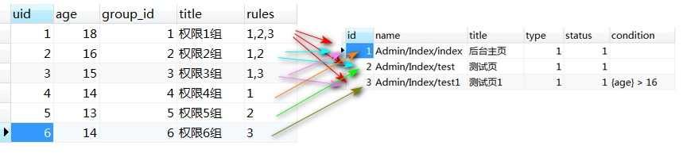

# 22.ThinkPHP-auth权限控制
[TOC]

本节课，我们将要学习一下 ThinkPHP 的 auth 权限控制，本课程简单的了解一下 Auth权限类的简单使用过程。
传梳RBAC是按节点进行认证的，如果要控制比节点更细的权限就有点困难了，比如页面上面的操作按钮， 我想判断用户权限来显示这个按钮， 如果没有权限就不会显示这个按钮； 再比如我想按积分进行权限认证， 积分在0-100时能干什么， 在101-200时能干什么。 这些权限认证用RABC都很困难。 
下面介绍 Auth权限认证， 它几乎是全能的， 除了能进行节点认证， 上面说的RABC很难认证的两种情况，它都能实现。 

## 一．权限介绍
所谓权限控制，大部分是在管理后台上使用。比如超级管理员登录，会得到所有操作的控制权；认证专员，只能给会员做认证操作；审核专员，只能操作内容的审核、删除、加精等操作，以此类推。那么 ThinkPHP 提供了一个内置的 Auth.class.php 类来实现权限控制，这个类提供了三个表：think_auth_rule(认证规则表)、think_auth_group(用户组表)、think_auth_group_access(用户和组对应关系表)。当然还要结合自己创建的用户表进行对应即可。

## 二．简单登录
第一步：在 Admin 模块下创建一个 IndexController.class.php（默认就有了），创建 index 方法，输出一句话即可。
```php
namespace Admin\Controller;
use Think\Controller;
class IndexController extends Controller {
    public function index() {
        echo '后台首页！';
    }
}
```
这是通过 URL 访问：http://localhost/demo39/Admin/Index/index，即可访问。

第二步：在 Weibo 根目录下的 Common 公共模块下创建 Controller 文件夹，并在里面创建一个 AuthController.class.php 类，这个类用于权限控制。
```php
namespace Common\Controller;
use Think\Controller;
use Think\Auth;
class AuthController extends Controller {
    protected function _initialize() {
        $auth = new Auth();
        if(!$auth->check()) {
            $this->error('没有权限');
        }
    }
}
```
这里使用的方法固定为：_initialize()。由于 AuthController.class.php 继承了Controller 类，所以，第一步的 Index 类改为继承它。
```php
namespace Admin\Controller;
use Common\Controller\AuthController;
class IndexController extends AuthController {
    public function index() {
        echo '后台首页！';
    }
}
```
此时，我们再访问后台首页的时候，已经没有权限了。主要是$auth->check()验证无法通过的原因。
第三步：创建一个 LoginController.class.php，模版为 index.tpl。
```html
<form method="post" action="{:U('index')}">
    <p>用户名：<input type="text" name="user" /></p>
    <p><input type="submit" value="登录" /></p>
</form>
```

```php
class LoginController extends Controller {
    public function index() {
        if (IS_POST) {
            $login = array();
            switch (I('user', null, false)) {
            case 'admin' :
                $login['uid'] = 1;
                $login['user'] = 'admin';
                break;
            case 'test' :
                $login['uid'] = 2;
                $login['user'] = 'test';
                break;
            case 'guest' :
                $login['uid'] = 3;
                $login['user'] = 'guest';
                break;
            default:
                $this->error('登录的用户不存在！');
            }
            if (count($login)) {
                session('auth', $login);
                $this->success('登录成功！', U('Index/index'));
            }
        } else {
        $this->display();
        }
    }
    public function logout() {
        session('[destroy]');
        $this->success('退出成功！', U('Login/index'));
    }
}
```
这里登录的 LoginController.class.php 类只要继承 Controller 即可，否则无法运行。因为继承 AuthController 类的是需要权限控制的类。
第四步：完善 AuthController 类的权限验证过程。
```php
class AuthController extends Controller {
    protected function _initialize() {
        $sess_auth = session('auth');
        if (!$sess_auth) {
            $this->error('非法访问！正在跳转登录页面！',
            U('Login/index'));
        }
        if ($sess_auth['uid'] == 1) {
            return true;
        }
        $auth = new Auth();
        if(!$auth->check(MODULE_NAME.'/'.CONTROLLER_NAME.'/'.ACTION_NAME, $sess_auth['uid'])){
            $this->error('没有权限', U('Login/logout'));
        }
    }
}
```


## 经过措索,上面的不合理,另配合用户表更方便
### 1.创mysql的四个表,
```sql
DROP TABLE IF EXISTS `think_member`;
CREATE TABLE `think_member` (
  `uid` int(11) NOT NULL AUTO_INCREMENT,
  `uname` varchar(20) DEFAULT NULL,
  `email` varchar(100) DEFAULT NULL,
  `age` int(11) DEFAULT NULL,
  PRIMARY KEY (`uid`)
) ENGINE=InnoDB AUTO_INCREMENT=7 DEFAULT CHARSET=utf8;
-- 测试数据 
INSERT INTO `think_member` VALUES ('1', '霍德明', 'huodeming1@163.com', '18');
INSERT INTO `think_member` VALUES ('2', '肖海华', 'xiaohaihua@163.com', '16');
INSERT INTO `think_member` VALUES ('3', '张三', 'zhangsan@163.com', '15');
INSERT INTO `think_member` VALUES ('4', '李四', 'lisi@163.com', '14');
INSERT INTO `think_member` VALUES ('5', '蜡笔小新', 'lbxx@qq.com', '13');
INSERT INTO `think_member` VALUES ('6', '黑崎一户', 'hqyh@qq.com', '14');

DROP TABLE IF EXISTS `think_auth_rule`;
CREATE TABLE `think_auth_rule` (
  `id` mediumint(8) unsigned NOT NULL AUTO_INCREMENT,
  `name` char(80) NOT NULL DEFAULT '',
  `title` char(20) NOT NULL DEFAULT '',
  `type` tinyint(1) NOT NULL DEFAULT '1',
  `status` tinyint(1) NOT NULL DEFAULT '1',
  `condition` char(100) NOT NULL DEFAULT '',
  PRIMARY KEY (`id`),
  UNIQUE KEY `name` (`name`)
) ENGINE=MyISAM AUTO_INCREMENT=4 DEFAULT CHARSET=utf8;
-- 测试数据
INSERT INTO `think_auth_rule` VALUES ('1', 'Admin/Index/index', '后台主页', '1', '1', '');
INSERT INTO `think_auth_rule` VALUES ('2', 'Admin/Index/test', '测试页', '1', '1', '');
INSERT INTO `think_auth_rule` VALUES ('3', 'Admin/Index/test1', '测试页1', '1', '1', '{age} > 16'); 

DROP TABLE IF EXISTS `think_auth_group`;
CREATE TABLE `think_auth_group` (
  `id` mediumint(8) unsigned NOT NULL AUTO_INCREMENT,
  `title` char(100) NOT NULL DEFAULT '',
  `status` tinyint(1) NOT NULL DEFAULT '1',
  `rules` char(80) NOT NULL DEFAULT '',
  PRIMARY KEY (`id`)
) ENGINE=MyISAM AUTO_INCREMENT=7 DEFAULT CHARSET=utf8;
INSERT INTO `think_auth_group` VALUES ('1', '权限1组', '1', '1,2,3');
INSERT INTO `think_auth_group` VALUES ('2', '权限2组', '1', '1,2');
INSERT INTO `think_auth_group` VALUES ('3', '权限3组', '1', '1,3');
INSERT INTO `think_auth_group` VALUES ('4', '权限4组', '1', '1');
INSERT INTO `think_auth_group` VALUES ('5', '权限5组', '1', '2');
INSERT INTO `think_auth_group` VALUES ('6', '权限6组', '1', '3');

DROP TABLE IF EXISTS `think_auth_group_access`;
CREATE TABLE `think_auth_group_access` (
  `uid` mediumint(8) unsigned NOT NULL,
  `group_id` mediumint(8) unsigned NOT NULL,
  UNIQUE KEY `uid_group_id` (`uid`,`group_id`),
  KEY `uid` (`uid`),
  KEY `group_id` (`group_id`)
) ENGINE=MyISAM DEFAULT CHARSET=utf8;
INSERT INTO `think_auth_group_access` VALUES ('1', '1');
INSERT INTO `think_auth_group_access` VALUES ('2', '2');
INSERT INTO `think_auth_group_access` VALUES ('3', '3');
INSERT INTO `think_auth_group_access` VALUES ('4', '4');
INSERT INTO `think_auth_group_access` VALUES ('5', '5');
INSERT INTO `think_auth_group_access` VALUES ('6', '6'); 
```

先解释下四个表的结构:

权限1是后台主页(Admin/Index/index)
权限2是后台test页(Admin/Index/test)
权限3是后台test1页(Admin/Index/test1),但同时要用户表中年龄不能小于18岁才能访问.

用户1-->权限组1-->拥用全部权限(1,2,3);  后面的用户名以此类推.....

## 2.测试验证权限
```php
namespace Admin\Controller;
use Think\Controller;
use Think\Auth;
header('Content-Type:text/html;charset=utf-8');//为了让页面正常显示中文
class IndexController extends Controller {
    public function index(){
        //print_r(I('session.'));
        echo '这是主页index,uid='.session('uid').',当前验证权限:'.MODULE_NAME.'/'.CONTROLLER_NAME.'/'.ACTION_NAME.'<br />';
        $auth = new Auth();
        $flag = $auth->check(MODULE_NAME.'/'.CONTROLLER_NAME.'/'.ACTION_NAME, session('uid'));
        if($flag){
            echo '权限验证成功<br />';
        }else{
            echo '权限验证失败<br />';
        }
    }
    public function _before_index(){
        echo '设置session的UID<br />';
        session('[destroy]');
        session('uid',6);
    }
    //--------------------------------------
    public function test(){
        //print_r(I('session.'));
        echo '这是test,uid='.session('uid').',当前验证权限:'.MODULE_NAME.'/'.CONTROLLER_NAME.'/'.ACTION_NAME.'<br />';
        $auth = new Auth();
        $flag = $auth->check(MODULE_NAME.'/'.CONTROLLER_NAME.'/'.ACTION_NAME, session('uid'));
        if($flag){
            echo '权限验证成功<br />';
        }else{
            echo '权限验证失败<br />';
        }
    }
    public function _before_test(){
        echo '设置session的UID<br />';
        session('[destroy]');
        session('uid',6);
    }
    //-----------------------------
    public function test1(){
        //print_r(I('session.'));
        echo '这是主页index1,uid='.session('uid').',当前验证权限:'.MODULE_NAME.'/'.CONTROLLER_NAME.'/'.ACTION_NAME.'<br />';
        $auth = new Auth();
        $flag = $auth->check(MODULE_NAME.'/'.CONTROLLER_NAME.'/'.ACTION_NAME, session('uid'));
        if($flag){
            echo '权限验证成功<br />';
        }else{
            echo '权限验证失败<br />';
        }
    }
    public function _before_test1(){
        echo '设置session的UID<br />';
        session('[destroy]');
        session('uid',6);
    }
```
> 注意,刚开始试了半天不成功,主要是用户表名必须用think_member(配合配置文件中数据库设置中的表前缀),主键必须用uid.不然得改Auth类的源代码.....

### 用四个表配合AuthController.class.php使用.非常好使,用路径规则配合自动权限检测

AuthController.class.php文件
```php
//路径为Admin/Common/Controller/AuthController.class.php;
namespace Admin\Common\Controller;
use Think\Controller;
use Think\Auth;

class AuthController extends Controller{
    protected function _initialize() {
        $auth = new Auth();
        //注意uid的获取,我直接用$_SESSION['uid']来保存.
        echo MODULE_NAME.'/'.CONTROLLER_NAME.'/'.ACTION_NAME;
        echo '<br />';
        echo 'uid='.I('session.uid');
        echo '<br />';
        $flag = $auth->check(MODULE_NAME.'/'.CONTROLLER_NAME.'/'.ACTION_NAME, session('uid'));
        echo '<a href="'.U('Login/index').'">点击登陆</a><br />';
        if(!$flag){
            $this->error('没有权限', U('Login/index'));//第二个参数:要跳转到哪自己写,或不写
            //echo '<p>没有权限!!!</p>';
        }else{
            //该做什么就做什么,或整个else块都不要.....
        }
    }
}
```
登陆页面,因此页面不需要权限认证,所以必须与权限认证的控制器分开,它继承Controller.
```php
namespace Admin\Controller;
use Think\Controller;

class LoginController extends Controller{
    public function index(){
        if(IS_POST){
            //session('[destroy]');//先销毁下session,这个用后获不到SESSION了.不能乱用
            session('uid',null);
            session('uid',I('post.uid'));
            $this->success('登陆成功,uid='.I('session.uid'),U('Index/test1'));
        }else{
            $this->display();
        }
    }
}
```
登陆页面的HTML代码,为了测试,我直接输UID进行测试
```html
	<form action="#" method="post">
	   uid:<input type="text" name="uid" value="">
	   <input type="submit" value="提交">
	</form>
```
需要认证的控制器
```php
namespace Admin\Controller;
use Think\Controller;
use Admin\Common\Controller\AuthController;

header('Content-Type:text/html;charset=utf-8');
class IndexController extends AuthController {
        public function test1(){
            //能见着下面这段话证明有权限,没权限会直接通过错误页跳转到登陆页去了.
            echo '这是主页index1,uid='.session('uid').',当前验证权限:'.MODULE_NAME.'/'.CONTROLLER_NAME.'/'.ACTION_NAME.'<br />';
    }
```


