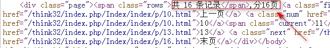

# 24.ThinkPHP-视图模型与分页
[TOC]

本节课，我们将要学习一下 ThinkPHP 的视图模型和数据分页。
## 一．视图模型
关联模型可以解决一对一、一对多和多对多等关联操作。它们通过生成多条 SQL 语句然后进行数组拼装得到最终想要的结果,即然用多条SQL语句,效率也会低,适用于复杂的关联。对于一对一这种 HAS_ONE 和 BELONGS_TO 的多表关联查询，可以使用视图模型。它采用的是联合查询（JOIN），非常适合此类查询需求。
//User控制器部分
```php
namespace Home\Controller;
use Think\Controller;

header('content-type:text/html;charset=utf-8');
class IndexController extends Controller {
    public function index(){
        $user = D('MemberView');
        $arr = $user->select();
        print_r($arr);
    }
}
```
//User模型部分
```php
namespace Home\Model;
use Think\Model\ViewModel;

class MemberViewModel extends ViewModel{
    protected $viewFields = array(
        'Member'=>array('uid','uname','email','_type'=>'LEFT'),//默认用join,加上条件后成left join
        'Usercard'=>array('code','_on'=>'Member.uid = Usercard.uid'),//如果不加条件就是笛卡尔乘积
    );
}
```
PS：使用关联查询，显示 User 表且包含 Card 表关联的数据，未关联的则忽略。如果想把未关联的查询出来，可以使用 LEFT 左查询。
//LEFT JOIN
```php
  'Member'=>array('uid','uname','email','_type'=>'LEFT'),//默认用join,加上条件后成left join
```
//使用group分组去除重复数据
```php
//改控制器中查询代码,把   $arr = $user->select(); 改成如下
$arr = $user->group('uid')->select();
```
//使用COUNT得到关联的条数
```php
'Usermsgs'=>array('msg','ctime','_on'=>'Member.uid = Usermsgs.uid','COUNT(Usermsgs.msg)'=>'count'),//它如果有多条留言,则会出现多条数据,如果我们只要首条,则查询时加上->group('uid'),还可以进行留言条数统计
```
注意:发现个BUG,三个表进行关联时,统计COUNT(Usermsgs.msg)'=>'count',显示6,但生成的SQL语句完全正确,无语中.....
BUG演示
```php
//模型中代码==============================================
namespace Home\Model;
use Think\Model\ViewModel;
class MemberViewModel extends ViewModel{
    protected $viewFields = array(
        'Member'=>array('uid','uname','email','_type'=>'LEFT'),//默认用join,加上条件后成left join
        'Usercard'=>array('code','_on'=>'Member.uid = Usercard.uid','_type'=>'LEFT'),//如果不加条件就是笛卡尔乘积
        //发现一个BUG,如果只用:Member与Usermsgs表进行关联,则结果是正确的,如果三表连接,SQL语句没问题,在SQL查询器是查询OK,但返回结果错了,用户uid=1的留言数显示6条,实际只有3条.
        'Usermsgs'=>array('msg','ctime','_on'=>'Member.uid = Usermsgs.uid','COUNT(Usermsgs.msg)'=>'count'),//它如果有多条留言,则会出现多条数据,如果我们只要首条,则查询时加上->group('uid'),还可以进行留言条数统计
    );
}
//控制器中代码===========================================
namespace Home\Controller;
use Think\Controller;

header('content-type:text/html;charset=utf-8');
class IndexController extends Controller {
    public function index(){
        //$user = D('MemberView');
        //$arr = $user->group('uid')->select();//注意模型中三表关联,结果统计uid=1的用户留言数是6,但下面SQL语句也是它生成的,在SQL查询分析器中得到结果是3,用它query()方法执行SQL语句也是3,无语啊......
        $user= D('Member');
        $arr = $user->query('SELECT Member.uid AS uid,Member.uname AS uname,Member.email AS email,Usermsgs.msg AS msg,Usermsgs.ctime AS ctime,COUNT(Usermsgs.msg) AS count FROM think_member Member LEFT JOIN think_usermsgs Usermsgs ON Member.uid = Usermsgs.uid GROUP BY Member.uid');
        print_r($arr);
    }
}
```


## 二．数据分页
ThinkPHP 封装了数据分页功能，只要进行一些设置即可完成分页。
//User控制器部分
```php
         $user = D('User');
         $count = $user->count();
         //var_dump($count);
         $page = new Page($count,1);//实例化对象
         //进行常用设置
         $page->setConfig('first','首页');
         $page->setConfig('prev','上一页');
         $page->setConfig('next','下一页');
         $page->setConfig('last','末页');
         $page->lastSuffix = false;//最后一页显示数字,最后一页的页码
         $page->rollPage = 5;//中间列表显示5个页面

         $page->setConfig('theme', '%HEADER%,分%TOTAL_PAGE%页 %FIRST% %UP_PAGE% %LINK_PAGE% %DOWN_PAGE% %END%');
         //$data = $user->page($page->firstRow,$page->listRows)->select();
         $data = $user->page(I('get.p'),$page->listRows)->select();//page()参数:page(页码,每页显示数量)
         $this->assign('data',$data);
         $this->assign('page',$page->show());
         $this->display();
```
//模版部分
```html
	<table border="1">
	<tr><th>ID</th><th>用户名</th><th>邮箱</th><th>年龄</th></tr>
	<foreach name="data" item="arr">
	<tr>
		<td>{$arr.uid}</td>
		<td>{$arr.uname}</td>
		<td>{$arr.email}</td>
		<td>{$arr.age}</td>
	</tr>
	</foreach>
	</table>
	{$page}
```
//设置分页参数
```php
$page->setConfig('first','首页');
$page->setConfig('prev','上一页');
$page->setConfig('next','下一页');
$page->setConfig('last','末页');//注意要结合lastSuffix属性,不然它依然是最后一页的页码
//在显示的时候分'%TOTAL_PAGE%页'部分有点小BUG,没有被任何标签包围,需改写下....如下图
$page->setConfig('theme', '%HEADER%,分%TOTAL_PAGE%页 %FIRST% %UP_PAGE% %LINK_PAGE% %DOWN_PAGE% %END%');
```



 另外还有一个分页方法，就是使用 page()方法
```php
$data = $user->page(I('get.p'),$page->listRows)->select();//page()参数:page(页码,每页显示数量)
```
//设置分页变量名
```php
'VAR_PAGE'=>'page',
```
//User控制器部分
```php
class UserController extends Controller {
    public function index() {
        $user = D('User');
        $list = $user->page($_GET['page'].',2')->select();
        $count = $user->count();
        $page = new Page($count, 2);
        $show = $page->show();
        $this->assign('list', $list);
        $this->assign('page', $show);
        $this->display();
    }
}
```
注意:最后我们改写Page类,把show()方法中的
```php
   return "<div>{$page_str}</div>"; 
//改成写如下,以方便写样式.美完结束
 return "<div class=\"page\">{$page_str}</div>";
```
