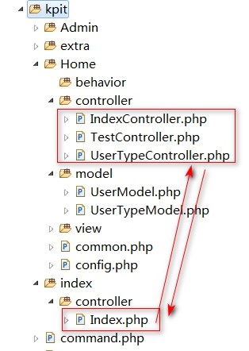
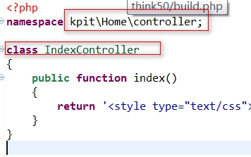
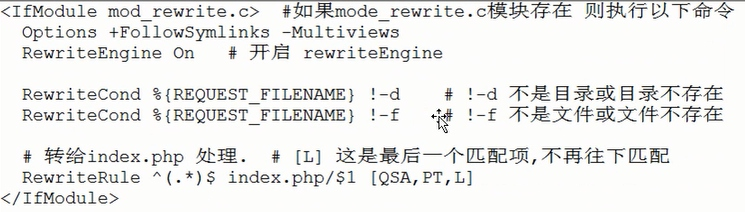

# 0.2ThinkPHP5.0-模块化与URL访问
[TOC]

## 应用目录更改 与 增加模块/自动生成  
### 1.默认应用目录更改
默认的应用目录是:application,一般不建议更改,特别在自动生成模块目录时会报错.如果要更改,操作如下
1.把application目录重命名,我是安全第一,复制了一份.目录为:kpit
2.修改入口文件中内容,
```php
// 定义应用目录public/index.php中更改
define('APP_PATH', __DIR__ . '/../kpit/');
```

### 自动生成
1.要配置build.php
默认根目录下面自带了一个build.php示例参考文件，内容如下：
```php
return [
    // 生成应用公共文件
    '__file__' => ['common.php', 'config.php', 'database.php'],
    // 定义demo模块的自动生成 （按照实际定义的文件名生成）
    'Demo'     => [
        '__file__'   => ['common.php'],
        '__dir__'    => ['behavior', 'controller', 'model', 'view'],
        'controller' => ['Index', 'Test', 'UserType'],
        'model'      => ['User', 'UserType'],
        'view'       => ['index/index'],
    ],
    // 其他更多的模块定义
];
```
根据上面内容,我们要在应用中创建两个模块,前台:Home,后台:Admin,那么复制build.php到application目录下,并修改成:
```php
return [
    // 生成应用公共文件
    '__file__' => ['common.php', 'config.php', 'database.php'],

    // 定义demo模块的自动生成 （按照实际定义的文件名生成）
    'Home'     => [
        '__file__'   => ['common.php'],
        '__dir__'    => ['behavior', 'controller', 'model', 'view'],
        'controller' => ['Index', 'Test', 'UserType'],
        'model'      => ['User', 'UserType'],
        'view'       => ['index/index'],
    ],
    // 其他更多的模块定义
    'Admin'     => [
        '__file__'   => ['common.php'],
        '__dir__'    => ['behavior', 'controller', 'model', 'view'],
        'controller' => ['Index', 'Test', 'UserType'],
        'model'      => ['User', 'UserType'],
        'view'       => ['index/index'],
    ],
];
```
1.执行PHP命令创建:
```shell
#进入到thinkphp项目根目录,如
cd /d D:\phpStudy2017\PHPTutorial\WWW\think50
#执行如下命令,如没配置好操作系统PATH则需先配置下,则会自动创建好Home 与 Admin 两模块,这是与3.X不同的地方.
php think build
# 注意 如果用命令,则要把build.php复制到application目录下.否则成功不了.
```
2.用入口文件创建(推荐)
```php
//1.在入口文件中
// 定义应用目录
define('APP_PATH', __DIR__ . '/../kpit/');//我修改了入口项目的路径
// 加载框架引导文件
require __DIR__ . '/../thinkphp/start.php';

// 读取自动生成定义文件
$build = include __DIR__ . '/../build.php';
// 运行自动生成模块
\think\Build::run($build,'kpit',true);//也可以只传第一个参数就行了.后面两个可以省略
```
注意:自动生成的目录结构有点小问题:如下图所示,在5.0中控制器不需要加Controller的了,要手动进行更改.或不要生成控制器与模型,如手动更改:（注意，新版的5.0已解决下面BUG，不需要人工更改）
把controller目录下的,如:IindexController.php 改成 Index.php,里面的内容也要更改
如图所示:Home目录是刚生成的,而index目录是以前有就的



修改自动生成控制器的代码


```php
namespace app\Home\controller;
class Index extends Controller{
    public function index(){
        //.............
    }
}
```
注意:我们生成模块目录时最好不生成控制器与模型,在build.php中配置中控制器与模型留空,但也会生成IndexController.php,手动改吧.
```php
        'controller' => [],
        'model'      => [],
```

## URL访问
### URL设计
```html
http://serverName/index.php（或者其它应用入口文件）/模块/控制器/操作方法/[参数名/参数值...] 
```
注意:5.0取消了URL模式的概念，并且普通模式的URL访问不再支持，但参数可以支持普通方式传值
```html
php.exe index.php(或者其它应用入口文件） 模块/控制器/操作?参数名=参数值&... 
```
如果不支持PATHINFO的服务器可以使用兼容模式访问如下： 
```html
http://serverName/index.php（或者其它应用入口文件）?s=/模块/控制器/操作/[参数名/参数值...] 
```
配置好虚拟主机,默认根目录指向public后,我们可通过域名直接访问到public/index.php文件.它的默认访问是:http://域名/index.php/模块/控制器/方法.如果在配置文件中指定了默认模块,则访问默认模块下的控制器模块名可以省略不写,如:
> 注：thinkphp5.0的系统默认配置文件在thinkphp/convention.php中，但不建议更改框架核心文件，如要修改默认模块等，请修改application/config.php文件。
```php
// 默认模块名,如果访问http://tp5.com/index.php 那么它会访问默认模块,默认控制器,默认操作名
//等同于:http://tp5.com/index.php/index/Index/index
//下面是参考配置项：
'default_module'         => 'index',
// 禁止访问模块,以免从外界访问到它.
'deny_module_list'       => ['common'],
// 默认控制器名
'default_controller'     => 'Index',
// 默认操作名,也就是控制器方法
'default_action'         => 'index',
```

### URL大小写 
默认情况下，URL是不区分大小写的，也就是说 URL里面的模块/控制器/操作名会自动转换为小写，控制器在最后调用的时候会转换为驼峰法处理。 
例如： 
```html
http://localhost/index.php/Index/Blog/read
// 和下面的访问是等效的
http://localhost/index.php/index/blog/read
```
如果访问下面的地址,控制器名用了多驼峰式命名,有多个大写字母时要注意,
```html
http://localhost/index.php/Index/BlogTest/read
// 和下面的访问是等效的
http://localhost/index.php/index/blogtest/read
```
在这种URL不区分大小写情况下，如果要访问驼峰法的控制器类，则需要使用： 
```html
http://localhost/index.php/Index/blog_test/read
```
如果希望URL访问严格区分大小写，可以在应用配置文件中设置： 
```php
    // 是否自动转换URL中的控制器和操作名,默认是true,它不区分大小写,注意URL写法.
    'url_convert'=> false,
```
一旦关闭自动转换，URL地址中的控制器名就变成大小写敏感了，例如前面的访问地址就要写成： 
```
http://localhost/index.php/Index/BlogTest/read
//但是下面的URL访问依然是有效的： 
http://localhost/index.php/Index/blog_test/read
//下面的URL访问则无效： 
http://localhost/index.php/Index/blogtest/read
```
>注意:特别是在非WINDOWS下,一旦关闭了大小写自动转换,就是开启了大小写敏感,那么URL要严格区分大小写.


## 隐藏入口文件 
在ThinkPHP5.0中，出于优化的URL访问原则，还支持通过URL重写隐藏入口文件，下面以Apache为例说明隐藏应用入口文件index.php的设置。 
下面是Apache的配置过程，可以参考下：
httpd.conf配置文件中加载了mod_rewrite.so模块
AllowOverride None 将None改为 All
 在应用入口文件同级目录添加.htaccess文件，内容如下： 
```php
<IfModule mod_rewrite.c>
  Options +FollowSymlinks -Multiviews
  RewriteEngine On

  RewriteCond %{REQUEST_FILENAME} !-d
  RewriteCond %{REQUEST_FILENAME} !-f
  RewriteRule ^(.*)$ index.php/$1 [QSA,PT,L]
</IfModule>
```
解释如下:

实测在PHP5.6中 ` RewriteRule ^(.*)$ index.php/$1 [QSA,PT,L]`这行在index.php后面要加个?, 不然不生效.改后 ` RewriteRule ^(.*)$ index.php?/$1 [QSA,PT,L]`

