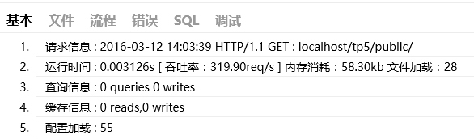
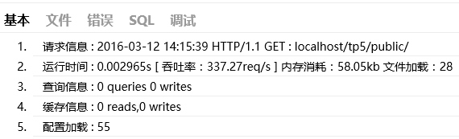

# 12.ThinkPHP5.0-错误调试与日志
[TOC]

## 调试模式
ThinkPHP有专门为开发过程而设置的调试模式，开启调试模式后，会牺牲一定的执行效率，但带来的方便和除错功能非常值得。
我们强烈建议ThinkPHP开发人员在开发阶段始终开启调试模式（直到正式部署后关闭调试模式），方便及时发现隐患问题和分析、解决问题。
应用默认开启调试模式，在完成开发阶段部署到生产环境后，可以修改应用配置文件的app_debug参数关闭调试模式切换到部署模式。
```php
// 关闭调试模式
'app_debug' => false,
```
由于调试模式没有任何缓存，因此涉及到较多的文件IO操作和模板实时编译，所以在开启调试模式的情况下，性能会有一定的下降，但不会影响部署模式的性能。另外需要注意的是，一旦关闭调试模式，项目的调试配置文件即刻失效。
一旦关闭调试模式，发生错误后不会提示具体的错误信息，如果你仍然希望看到具体的错误信息，那么可以如下设置：
```php
// 显示错误信息
'show_error_msg'        =>  true,    
```

## Trace调试
调试模式并不能完全满足我们调试的需要，有时候我们需要手动的输出一些调试信息。除了本身可以借助一些开发工具进行调试外，ThinkPHP还提供了一些内置的调试工具和函数。例如，Trace调试功能就是ThinkPHP提供给开发人员的一个用于开发调试的辅助工具。可以实时显示当前页面的操作的请求信息、运行情况、SQL执行、错误提示等，并支持自定义显示，5.0版本的Trace调试支持没有页面输出的操作调试。
Trace调试功能对调试模式和部署模式都有效，可以单独开启和关闭。
 只是在部署模式下面，显示的调试信息没有调试模式完整，通常我们建议Trace配合调试模式一起使用。

开启Trace调试
默认关闭Trace调试功能，要开启Trace调试功能，只需要配置下面参数：
```php
// 开启应用Trace调试
'app_trace' =>  true,
```
如果定义了环境变量app_trace，那么以环境变量配置为准。

页面Trace显示
要开启页面Trace功能，需要配置trace参数为：
```php
// Trace信息
'trace'     =>  [
    //支持Html,Console
    'type'  =>  'html',
] 
```
设置后并且你的页面有输出的话，页面右下角会显示ThinkPHP的LOGO：

我们看到的LOGO后面的数字就是当前页面的执行时间（单位是秒） 点击该图标后，会展开详细的Trace信息，如图：

Trace的选项卡是可以定制和扩展的，默认的配置为：
```php
// 显示Trace信息
'trace' =>[
    'type'       =>  'Html',
    'trace_tabs' =>  [
         'base'=>'基本',
         'file'=>'文件',
         'info'=>'流程',
         'error|notice'=>'错误',
         'sql'=>'SQL',
         'debug|log'=>'调试'
     ]
]
```
也就是我们看到的默认情况下显示的选项卡，如果你希望增加新的选项卡：用户，则可以修改配置如下：
```php
// 显示Trace信息
'trace' =>[
    'type'       =>  'Html',
    'trace_tabs' =>  [
         'base'=>'基本',
         'file'=>'文件',
         'info'=>'流程',
         'error'=>'错误',
         'sql'=>'SQL',
         'debug'=>'调试',
         'user'=>'用户'
     ]
]
```
也可以把某几个选项卡合并，例如：
```php
// 显示Trace信息
'trace' =>[
    'type'       =>  'Html',
    'trace_tabs' =>  [
         'base'=>'基本',
         'file'=>'文件',
         'error|notice'=>'错误',
         'sql'=>'SQL',
         'debug|log|info'=>'调试',
     ]
]
```
更改后的Trace显示效果如图：

浏览器Trace显示
trace功能支持在浏览器的console直接输出，这样可以方便没有页面输出的操作功能调试，只需要设置：
```php
// Trace信息
'trace' =>[
    // 使用浏览器console输出trace信息
    'type'  =>  'console',
] 
```
运行后打开浏览器的console控制台可以看到如图所示的信息：

浏览器Trace输出仍然支持trace_tabs设置。

用trace调试变量
```php
trace('出错了!!!','debug');//会显示一行'出错了!!!'在trace的调试选项卡中....
```

## 变量调试
除了Trace调试之外，系统还提供了\think\Debug类用于各种调试。
输出某个变量是开发过程中经常会用到的调试方法，除了使用php内置的var_dump和print_r之外，ThinkPHP框架内置了一个对浏览器友好的dump方法，用于输出变量的信息到浏览器查看。

用法：
```php
Debug::dump($var, $echo=true, $label=null)
//或者
dump($var, $echo=true, $label=null)
```
相关参数的使用如下：
```table
参数 | 描述
var |（必须） 要输出的变量，支持所有变量类型 
echo |（可选） 是否直接输出，默认为true，如果为false则返回但不输出 
label |（可选） 变量输出的label标识，默认为空 
```
使用示例：
```php
 $blog = Db::name('blog')->where('id', 3)->find();
 Debug::dump($blog);
 // 下面的用法是等效的
 dump($blog);
```
如果需要在调试变量输出后中止程序的执行，可以使用halt函数，例如：
```php
 $blog = Db::name('blog')->where('id', 3)->find();
 halt($blog);
 echo '这里的信息是看不到的';
```

## 性能调试[了解]
开发过程中，有些时候为了测试性能，经常需要调试某段代码的运行时间或者内存占用开销，系统提供了think\Debug类可以很方便的获取某个区间的运行时间和内存占用情况。 例如：
```php
Debug::remark('begin');
// ...其他代码段
Debug::remark('end');
// ...也许这里还有其他代码
// 进行统计区间
echo Debug::getRangeTime('begin','end').'s';
```
表示统计begin位置到end位置的执行时间（单位是秒），begin必须是一个已经标记过的位置，如果这个时候end位置还没被标记过，则会自动把当前位置标记为end标签，输出的结果类似于：0.0056s
默认的统计精度是小数点后4位，如果觉得这个统计精度不够，还可以设置例如：
```php
echo Debug::getRangeTime('begin','end',6).'s';
```
可能的输出会变成：0.005587s
如果你的环境支持内存占用统计的话，还可以使用getRangeMem方法进行区间内存开销统计（单位为kb），例如：
```php
echo Debug::getRangeMem('begin','end').'kb';
```
第三个参数使用m表示进行内存开销统计，输出的结果可能是：625kb
同样，如果end标签没有被标记的话，会自动把当前位置先标记位end标签。
助手函数
系统还提供了助手函数debug用于完成相同的作用，上面的代码可以改成：
```php
debug('begin');
// ...其他代码段
debug('end');
// ...也许这里还有其他代码
// 进行统计区间
echo debug('begin','end').'s';
echo debug('begin','end',6).'s';
echo debug('begin','end','m').'kb';
```
## 日志
日志记录由\think\Log类完成，主要完成日志记录和跟踪调试。由于日志记录了所有的运行错误，因此养成经常查看日志文件的习惯，可以避免和及早发现很多的错误隐患。

日志初始化
在使用日志记录之前，首先需要初始化日志类，指定当前使用的日志记录方式。
```php
Log::init([
    'type'  =>  'File',
    'path'  =>  APP_PATH.'logs/'
]);
```
日志驱动
日志可以通过驱动支持不同的方式写入，默认日志会记录到文件中，系统已经内置的写入驱动包括 File、Socket，如果要临时关闭日志写入，可以设置日志类型为Test即可，例如：
```php
'log'   => [
    // 可以临时关闭日志写入
    'type'  => 'test',
],
```
File驱动
日志的记录方式默认是File方式，可以通过驱动的方式来扩展支持更多的记录方式。
记录方式由log.type参数配置，例如：
```php
'log'   => [
    // 日志记录方式，支持 file socket
    'type' => 'File',
    //日志保存目录
    'path' => LOG_PATH,
    //单个日志文件的大小限制，超过后会自动记录到第二个文件
    'file_size'     =>2097152,
    //日志的时间格式，默认是` c `
    'time_format'   =>'c'
],
```
为了避免同一个目录下面的日志文件过多的性能问题，file方式记录的日志文件会自动生成日期子目录。
手动记录

一般情况下，系统的日志记录是自动的，无需手动记录，但是某些时候也需要手动记录日志信息，Log类提供了3个方法用于记录日志。
```table
方法 | 描述
Log::record() | 记录日志信息到内存 
Log::save() | 把保存在内存中的日志信息（用指定的记录方式）写入 
Log::write() | 实时写入一条日志信息 
```

由于系统在请求结束后会自动调用Log::save方法，所以通常，你只需要调用Log::record记录日志信息即可。
record方法用法如下：
```php
Log::record('测试日志信息');
```
默认的话记录的日志级别是INFO，也可以指定日志级别：
```php
Log::record('测试日志信息，这是警告级别','notice');
```
采用record方法记录的日志信息不是实时保存的，如果需要实时记录的话，可以采用write方法，例如：
```php
Log::write('测试日志信息，这是警告级别，并且实时写入','notice');
```
V5.0.4+版本开始，为避免内容溢出，在命令行下面执行的话 日志信息会定时自动写入。
日志级别
ThinkPHP对系统的日志按照级别来分类，并且这个日志级别完全可以自己定义，系统内部使用的级别包括：
• log 常规日志，用于记录日志
• error 错误，一般会导致程序的终止
• notice 警告，程序可以运行但是还不够完美的错误
• info 信息，程序输出信息
• debug 调试，用于调试信息
• sql SQL语句，用于SQL记录，只在数据库的调试模式开启时有效
系统提供了不同日志级别的快速记录方法，例如：
```php
Log::error('错误信息');
Log::info('日志信息');
// 和下面的用法等效
Log::record('错误信息','error');
Log::record('日志信息','info');
```
还封装了一个助手函数用于日志记录，例如：
```php
trace('错误信息','error');
trace('日志信息','info');
```
也支持指定级别日志的输入，需要配置信息：
```php
'log'   => [
    'type'  => 'File',
    // 日志记录级别，使用数组表示
    'level' => ['error'],
],
```
独立日志
为了便于分析，File类型的日志驱动还支持设置某些级别的日志信息单独文件记录，例如：
```php
'log'   => [
    'type'          => 'file', 
    // error和sql日志单独记录
    'apart_level'   =>  ['error','sql'],
],
```
设置后，就会单独生成error 和 sql两个类型的日志文件，主日志文件中将不再包含这两个级别的日志信息。
独立日志文件按天保存，不限制大小。
日志清空
日志类提供了日志清空的方法，可以在需要的时候手动清空日志，日志清空仅仅是清空内存中的日志。
使用方法如下：
```php
Log::clear();
```
日志写入授权
5.0的日志功能支持写入授权，我们可以设置某个请求的日志授权Key，然后设置允许授权写入的配置Key，实现个别用户日志记录的功能，从而提高高负载下面的日志记录性能。

首先需要在应用配置文件或者应用公共文件中添加当前访问的授权Key定义，例如：
```php
// 设置IP为授权Key
Log::key(Request::instance()->ip());
```
然后在日志配置参数中增加allow_key参数，如下：
```php
'log'   =>  [
    // 日志类型为File
    'type'      =>  'File',
    // 授权只有202.12.36.89 才能记录日志
    'allow_key' =>  ['202.12.36.89'],
]
```


