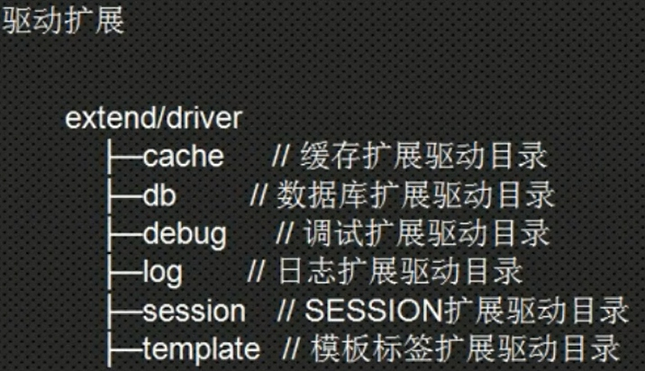

# 13.ThinkPHP5.0-扩展
[TOC]

## 函数
你可以方便的在ThinkPHP5中添加自定义函数，包括替换已有的助手函数。
### 添加应用函数
如果需要给当前应用添加函数，只需要在应用的公共文件（application/common.php）中定义需要的函数即可，系统会自动加载，如果你需要增加新的函数文件，例如需要增加一个sys.php，那么就需要和上面一样设置extra_file_list配置：
```php
// 扩展函数文件
'extra_file_list'        => [ APP_PATH . 'helper.php', THINK_PATH . 'helper.php', APP_PATH . 'sys.php'],
```
### 扩展系统函数
这里指的系统函数是对系统自带的函数进行替换或者增加，具体方式如下：
在应用目录下面增加一个助手函数文件（文件名随意，例如application/helper.php），添加：
```php
// 增加一个新的table助手函数
function table($table, $config = [])
{
    return \think\Db::connect($config)->setTable($table);
}
// 替换已有的db助手函数
function db($name, $config= [])
{
    return \think\Db::connect($config)->name($name); 
}
```

然后，在应用配置文件中设置：
```php
// 扩展函数文件
'extra_file_list'        => [ APP_PATH . 'helper.php', THINK_PATH . 'helper.php'],
```
extra_file_list 定义的顺序不能反，否则就不能替换已有的助手函数。
注意，尽量避免直接修改核心的helper.php文件。

## 类库
如果你需要在核心之外扩展和使用第三方类库，并且该类库不是通过Composer安装使用，那么可以直接放入应用根目录下面的extend目录下面，该目录是官方建议的第三方扩展类库目录。

类的命名规范遵循PSR-2及PSR-4规范，例如，如果有一个扩展类库的命名空间是 first\second\Foo，类定义如下：
```php
//注意此文件创在extend目录下.
namespace first\second;
class Foo 
{
}
```
使用第三方类库的时候注意不要和系统的命名空间产生冲突，例如核心的think、app以及Composer类库自身定义的命名空间。

那么实际的类文件位置应该是：
extend/first/second/Foo.php

使用first.second.Foo类的时候，直接实例化即可使用，例如：
```php
$foo = new \first\second\Foo();
//或者先
use first\second\Foo;
//然后
$foo = new Foo();
```

你可以在入口文件中随意修改extend目录的名称，例如：
```php
define('EXTEND_PATH', '../extension/');
```
ThinkPHP5建议所有的扩展类库都使用命名空间定义，如果你的类库没有使用命名空间，则不支持自动加载，必须使用Loader::import方法先导入文件后才能使用。
```php
Loader::import('first.second.Foo');
$foo = new \Foo();
```

## 驱动
系统的驱动类都支持单独扩展，并且驱动文件的位置和命名空间可以随意设置，包括缓存、日志、调试和数据库驱动。
以日志为例,我们写一个驱动,当网页出错时,给系统管理员发短信或邮件,而不是保存日志
在手册及官网上没有透露出太多,我们参考着写
驱动扩展建议写在extend/driver目录下.参考如下图:

```php
//自定义的日志处理驱动扩展.文件位于:extend/driver/log/Message.php
<?php
namespace driver\log;

class Message{
    //默认配置
    protected $config = [
        'mobile'=>'13087281590',
        'email'=>'56928691@qq.com'
    ];
    //构造方法,传入配置参数,不传为默认
    public function __construct($config=[]){
        if(is_array($config)){
            //合并两个数组,如下下标相同,则后面的覆盖前面的值.
            $this->config = array_merge($this->config,$config);
        }
    }
    //处理日志方法
    /**
     * 日志写入接口
     * @access public
     * @param array $log 日志信息
     * @return bool
     */
    public function save(array $log = [])
    {
        echo '已经给'.$this->config['mobile'].'发送短信,并已邮件通知到:'.$this->config['email'];
        print_r($log);//打印出详细信息
        return true;
    }
}
```
2.在配置文件中配置自定义的日志
```php
    // +----------------------------------------------------------------------
    // | 日志设置
    // +----------------------------------------------------------------------
    'log'                    => [
        // 日志记录方式，内置 file socket 支持扩展
        //'type'  => 'File',
        'type'  => 'driver\log\Message',
        // 要发送短信的号码
        'mobile'  => '13800000000',
        // 要发送邮箱的地址
        'email' => 'huodeming1@163.com',
    ],
```

