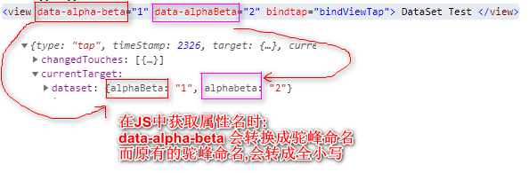

# 事件
[TOC]

## [事件](https://mp.weixin.qq.com/debug/wxadoc/dev/framework/view/wxml/event.html)  

- 事件对象可以获取额外信息，如 id, dataset(自定义属性集合), touches(触摸点坐标)。

### 事件绑定和冒泡

1. 冒泡事件    bind事件类型        如	 `bindtap`   `bindlongpress`
2. 非冒泡事件    catch事件类型    如  `catchtap`   ` catchlongpress`

### 常用事件类型

| 类型      | 触发条件                                                     |
| --------- | ------------------------------------------------------------ |
| tap       | 手指触摸后马上离开                                           |
| longpress | 手指触摸后，超过350ms再离开，如果指定了事件回调函数并触发了这个事件，tap事件将不被触发 |

```xml
<!--wxml-->
<view data-index="自定义属性" bindtap="tapHandle"> 点我触发事件 </view>
```

```javascript
// page.js
Page({
  tapHandle: function(event) {
    console.log(event)
  }
})
```

### 事件传参注意

小程序绑定事件只能写函数名称，不能通过括号方式传参。

```xml
<!--wxml-->
<view bindtap="tapHandle(520)"> 点我触发事件 </view>								错误，事件不能触发
<view data-index="520" bindtap="tapHandle"> 点我触发事件 </view>	
```

```javascript
// page.js
Page({
  tapHandle: function(event) {
     console.log( event.target.dataset.index );  // 输出标签自定义属性上的index值
  }
})
```
### 事件对象
```table
属性 |	类型 |	说明
type|String|	事件类型
timeStamp|	Integer|	事件生成时的时间戳
target|	Object	|触发事件的组件的一些属性值集合(事件注册/绑定所在组件)
currentTarget|	Object	|当前组件(触发事件组件)的一些属性值集合
```

事件对象又分为Target和currentTarget：
```table
属性 |	类型	| 说明
id | String | 事件源组件的id
tagName |	String | 当前组件的类型
dataset | Object | 事件源组件上由data-开头的自定义属性组成的集合
```
举例说明Target和currentTarget的区别:
```xml
<view id="outer" bind:touchstart="handleTap1" capture-catch:touchstart="handleTap2">
  outer view
  <view id="inner" bind:touchstart="handleTap3" capture-bind:touchstart="handleTap4">
    inner view
  </view>
</view>
```
> 点击 inner view 时，handleTap3 收到的事件对象 target 和 currentTarget 都是 inner，而 handleTap2 收到的事件对象 target 就是 inner，currentTarget 就是 outer。（即 当组件可冒泡时，父级对象被动触发时，父级事件对象的Target就是父级自己，而currentTarget是子级(因事件是子级触发的,冒泡给的父级)。）

其中dataset是组件中以data-开头的标签属性,多个单词由连字符-链接的属性集合.一般用于给事件传参.
注意dataset中的属性名写法:


## 练习,点击数字+1
```xml
<!--pages/test/test.wxml-->
<view>
  <button bindtap="mytap">点击+1</button>
  <view>{{num}}</view>
</view>
```
```javascript
// pages/test/test.js
Page({

  /**
   * 页面的初始数据
   */
  data: {
    num: 0
  },
  mytap: function(e){
    //console.log(this.data.num);//得到data中数据
    //设置data中数据this.data.num++;是无效的.要用setData方法
    this.setData({
      num: this.data.num + 1,
    });
  },
  //...后面无关的生命周期方法与事件,给删了....
})
```


