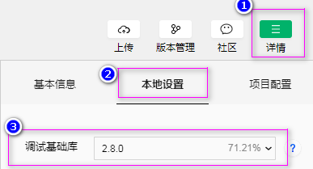

# 10-小程序云开发
[TOC]

## 什么是云开发
腾讯云 + 微信小程序   
不需要后台服务器来提供数据,直接使用腾讯云相关的三个功能就行:云函数,云数据库,云存储.

### 传统开发模式
小程序客户端(界面) + 远程服务器(后端+数据库)
运维成功高....(DB运维,文件存储,内容加速,网络维护,容器服务,负载均衡,安全加固...等)

### 云开发模式
小程序客户端(界面) + 云函数,云数据库,云存储
云函数是NodeJS的函数,所以前端工程师,必须撑握这门语言.

### 云开发三大基础能力支持
1. 云函数,可以很方便的获取appid,用户的openid,生成分享图,调用腾讯云SDK,操作数据库,文件等....
2. 云数据库:可以很方便的取代传统数据库
3. 云存储:存放各种文件,并可手工管理....

### 云开发 VS 传统开发
用开店来打比方:
传统开发,自己买地建房子装修后开店.
云开发,按需租用别人已开装修好的店.
> 所以: 云开发(Serverless)无服务的开发模式,是小程序未来的发展趋势...
但也有缺点,比如淘宝,有自己的现有数据,且更新率大.显而易见, 传统模式更合适.

## 开通云开发
在开发工具中点击 云开发 就行.,暂时基础版免费对用户开放.并且每个小程序帐号可免费创建两个环境.建议一个用于开发,一个用于生产.
注意: 要使用云开发,项目的调试基础库版本必须设置成2.2.3以上版本.

